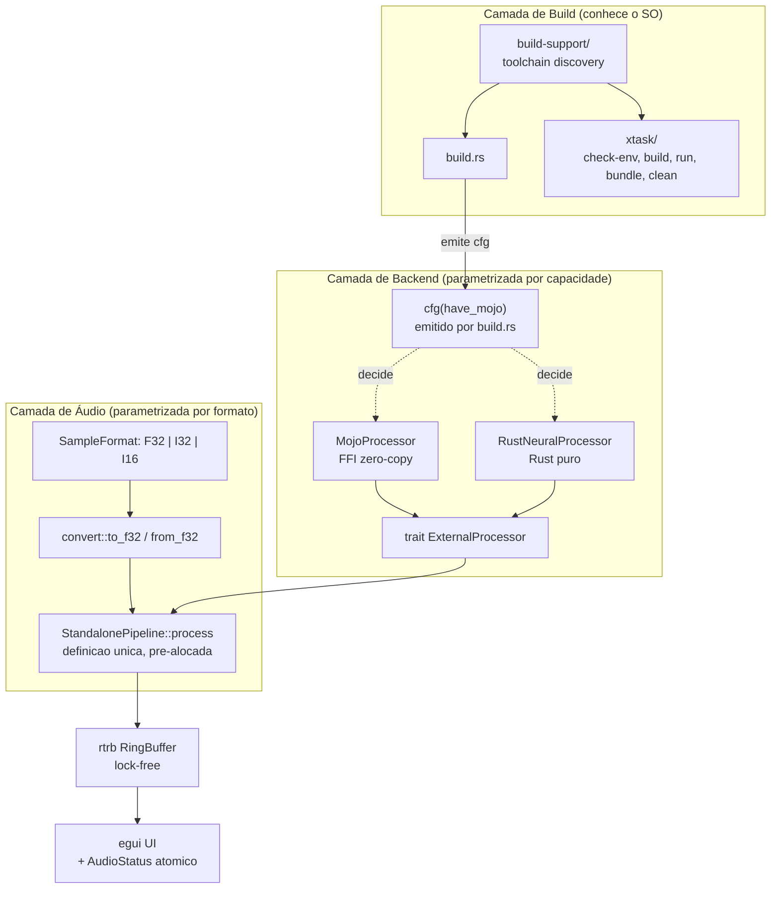

# Cross-Platform Support Design

**Spec**: `.specs/features/cross-platform/spec.md`
**Status**: Draft
**Constraint transversal**: CROSS-22 — nenhuma decisão abaixo pode introduzir alocação, lock ou cópia
na thread de áudio, nem aumentar a latência do pipeline.

---

## Architecture Overview

A portabilidade divide-se em três camadas independentes. A camada de **build** é a única que precisa
de conhecer o sistema operativo; as camadas de **backend** e de **áudio** são parametrizadas por
*capacidade* e por *formato*, nunca por SO.

O erro estrutural do estado atual é que os três consumidores de "onde está o Faust/Mojo?" —
`Makefile`, `scripts/check_env.sh` e `build.rs` — implementam a resposta três vezes, cada um com uma
lista de caminhos diferente e nenhum a concordar com os outros. O design colapsa isso num único crate
`build-support/`, consumido por `build.rs` e por `xtask`.



**Fluxo de decisão de backend** (CROSS-03): `build.rs` tenta localizar e compilar o Mojo. Se
consegue, emite `cargo::rustc-cfg=have_mojo` e as diretivas de linking. Se não encontra o toolchain,
não emite nada e o código Rust compila o fallback. Se encontra o toolchain mas a **compilação falha**,
faz panic — ausência de toolchain e build partido são condições distintas.

---

## Code Reuse Analysis

### Existing Components to Leverage

| Component | Location | How to Use |
|---|---|---|
| `nih_plug_xtask` | `xtask/` (já no workspace) | `main_with_args(cmd, args)` delega `bundle`; `chdir_workspace_root()` normaliza o CWD. Verificado em `~/.cargo/git/checkouts/nih-plug-*/nih_plug_xtask/src/lib.rs:77,158` |
| `trait ExternalProcessor` | `src/bridge/mod.rs:8` | `RustNeuralProcessor` implementa-a sem alterar a trait — o resto do código já é agnóstico ao backend |
| `MojoProcessor` | `src/bridge/mojo.rs:20` | Preservado intacto em Linux/macOS; a lógica tanh polinomial é copiada literalmente para Rust |
| `VariantRegistry` | `src/lab/` | Ganha resolução por alias: o impl id `mojo-neural` mapeia para o backend disponível |
| `rtrb::RingBuffer` | `src/bin/standalone.rs:735` | Já é o transporte lock-free; reutilizado para o canal de erros (CROSS-10) |
| `rubato 1.0.1` | `Cargo.toml:31`, `src/core/cabinet/runtime.rs:4` | Já é dependência para resample offline de IRs (`Fft` + `FixedSync`); reutilizado em tempo real via `Async::new_sinc` + `process_into_buffer` — `Async`, não `Fft`, porque só ele permite trim de rácio |
| `dsp/FaustModule.hpp`, `dsp/MlcZeroVModule.hpp` | versionados em git | Permitem build sem Faust instalado (edge case da spec) |
| `find_mojo_path()` | `build.rs:5` | Movido para `build-support`, generalizado para `which_like()` |
| Pipeline DSP inline | `src/bin/standalone.rs:775–1190` | Extraído sem alteração semântica para `StandalonePipeline` |

### Integration Points

| System | Integration Method |
|---|---|
| `build.rs` → código Rust | `cargo::rustc-cfg=have_mojo` + `cargo::rustc-check-cfg=cfg(have_mojo)` (Rust ≥ 1.80) |
| `build.rs` → linker | `cargo:rustc-link-lib=neural` e `cargo:rustc-link-arg=-Wl,-rpath,...` emitidos só quando `have_mojo` |
| `xtask` → `nih_plug_xtask` | Match sobre `args[0]`; verbos desconhecidos delegam a `main_with_args` |
| `xtask` → `build-support` | `path = "../build-support"` no `Cargo.toml` do xtask |
| `build.rs` → `build-support` | `[build-dependencies] build-support = { path = "build-support" }` |
| Standalone → pipeline | `StandalonePipeline` é construída fora do callback e movida para dentro da closure |
| Plugin → host DAW | `set_latency_samples` movido de `process()` para `initialize()`, com cache do último valor |
| Lab DB → backend | `VariantRegistry::resolve(impl_id)` normaliza `mojo-neural` → factory disponível |

### Componentes a criar

| Component | Location | Reason |
|---|---|---|
| `build-support` | `build-support/src/lib.rs` | Fonte única de verdade sobre toolchain e nomes de artefactos |
| `RustNeuralProcessor` | `src/bridge/neural_rust.rs` | Fallback CROSS-03 |
| `StandalonePipeline` | `src/core/dsp/standalone_pipeline.rs` | Definição única do pipeline, pré-condição de CROSS-07 |
| `sample_convert` | `src/core/dsp/sample_convert.rs` | `I32`/`I16` ↔ `f32` normalizado |
| `AudioStatus` | `src/core/audio_status.rs` | Canal de erro lock-free + telemetria de drop (CROSS-10, CROSS-26) |
| `rt_resampler` | `src/core/dsp/rt_resampler.rs` | Resampling RT + controlador de drift (CROSS-13) |
| `.github/workflows/ci.yml` | novo | CROSS-17 |
| `docs/BUILD.md` | novo | CROSS-23 |

---

## Build System Decision

### O problema concreto

O `Makefile` atual não é apenas "não-portável" em abstrato. São cinco dependências duras em Unix:

1. `Makefile:4` — `bash ./scripts/check_env.sh`; não há `bash` em `cmd.exe`/PowerShell limpo
2. `Makefile:35,48,61` — `command -v` é um builtin POSIX; não existe no Windows
3. `Makefile:7-13` — `export LD_LIBRARY_PATH` não tem efeito em Windows (é `PATH`) nem em macOS (é `DYLD_LIBRARY_PATH`)
4. `Makefile:64,66` — `-o neural/libneural.so` hardcoded
5. `Makefile:25-30` — `[ -f ... ]` e continuação de linha com `\` são sintaxe de shell POSIX

E há um sexto problema, independente da portabilidade: **`Makefile:7-9` exporta `LIBTORCH`,
`LIBTORCH_BYPASS_VERSION_CHECK` e um `LD_LIBRARY_PATH` para `~/libtorch`, mas `Cargo.toml` não tem
qualquer dependência `tch` ou `torch`** (verificado: `grep -n "tch\|torch" Cargo.toml` → vazio). São
exports mortos que qualquer reescrita deve remover, não traduzir.

### Critérios e avaliação

Pesos: portabilidade e manutenibilidade dominam, porque este é um projeto de um só developer que
desenvolve em Linux e precisa de confiar num CI que corre em três SOs sem poder depurar interativamente
em dois deles.

| Critério (peso) | GNU Make (status quo) | Just | cargo-make | **xtask (Rust)** | Scripts sh + ps1 |
|---|---|---|---|---|---|
| **Portabilidade (×3)** | ✗ Exige MSYS2/Git Bash no Windows; sintaxe de shell embutida | ~ Binário cross-platform, mas as *receitas* continuam a ser shell; precisa de `[windows]`/`[unix]` duplicados | ~ Portável; scripting portável só via `duckscript` (DSL própria) | ✓ `cfg!(target_os)` + `std::path`/`std::process` resolvem nativamente | ✗ Duplicação total da lógica em duas linguagens |
| **Manutenibilidade (×3)** | ✗ Lógica de toolchain duplicada em 3 sítios | ~ Duplicação por-OS dentro do justfile | ~ TOML verboso; `duckscript` é uma linguagem a mais para manter | ✓ Mesma linguagem que `build.rs`; **partilha o crate `build-support`, eliminando a duplicação tripla** | ✗ Pior caso |
| **Integração com cargo (×2)** | ✗ Camada externa; `make bundle` já delega a `cargo xtask` | ✗ Camada externa | ✓ `cargo make` | ✓ `cargo xtask`; **`xtask/` já existe no workspace** | ✗ Externa |
| **Curva de aprendizagem (×2)** | ✓ Universal | ~ Sintaxe nova, próxima de Make | ✗ TOML + duckscript + conceitos próprios | ✓ Rust — o contribuidor **já tem de saber** para tocar em `build.rs` | ✓ Trivial |
| **Instalação (×2)** | ~ Presente em Linux/macOS, ausente em Windows | ✗ `cargo install just` | ✗ `cargo install cargo-make` | ✓ **Zero instalação** — só cargo | ✓ Zero |
| **Testabilidade (×1)** | ✗ Nenhuma | ✗ Nenhuma | ✗ Nenhuma | ✓ `cargo test -p build-support` testa a descoberta de toolchain | ✗ Nenhuma |
| **Performance (×1)** | ✓ ~0 ms | ✓ ~5 ms | ~ ~150 ms de arranque | ~ 2–5 s na primeira compilação, ~30 ms depois (cached) | ✓ ~0 ms |

### Recomendação: **xtask (Rust)**, com `Makefile` reduzido a fachada opcional

Três factos decidem, e são específicos deste repositório e não de uma preferência genérica:

1. **`xtask/` já existe e já é usado.** `Cargo.toml:11` declara-o como membro do workspace e
   `Makefile:84` já executa `cargo xtask bundle distortion --release`. Adotar xtask não introduz uma
   ferramenta nova — **remove** a única que ainda não é xtask. `nih_plug_xtask::main_with_args()`
   (`lib.rs:77`) permite interceptar verbos próprios e delegar `bundle` ao upstream sem o reimplementar.

2. **A duplicação a eliminar é lógica Rust, não lógica de shell.** `find_mojo_path()` já existe em
   `build.rs:5-29`, escrita em Rust. `check_env.sh` reimplementa-a em bash com caminhos diferentes, e
   `Makefile:61` reimplementa-a uma terceira vez. Um crate `build-support` partilhado por `build.rs` e
   `xtask` colapsa as três numa. **Nenhuma das outras opções consegue isto**, porque nenhuma pode ser
   importada por `build.rs` — Just e cargo-make invocam processos, não partilham código com o build script.

3. **A pré-condição do xtask já é obrigatória.** O único custo real do xtask é "o contribuidor precisa
   de Rust". Mas este projeto tem um `build.rs` de 206 linhas que orquestra Faust, Mojo, `cc` e
   `bindgen`; quem contribui já lê e escreve Rust. O custo é zero na margem.

O contra-argumento honesto é a latência de arranque: `cargo xtask` compila o crate na primeira
invocação (2–5 s). Mitiga-se com o `Makefile` mantido como fachada de três linhas em Unix
(`build: ; cargo xtask build`), preservando a memória muscular sem manter lógica duplicada. O
`Makefile` deixa de conter regras — só delegação — e `scripts/check_env.sh` e
`scripts/run_standalone.sh` são apagados.

**Rejeitados**: *Just* perde precisamente onde mais dói — as receitas continuam a ser shell, e um
`justfile` com `[windows]`/`[unix]` sobre cada receita mantém a duplicação que queremos eliminar,
acrescentando um `cargo install`. *cargo-make* resolve a portabilidade mas paga-a com `duckscript`, uma
DSL que ninguém neste projeto conhece e que não pode ser testada nem partilhada com `build.rs`.
*Scripts sh + ps1* é a duplicação levada ao extremo. *Manter o Makefile* exige MSYS2 no Windows, o que
transforma um pré-requisito de build num pré-requisito de ambiente e torna o CI Windows frágil.

### Superfície de comandos resultante

| Verbo | Implementação | Substitui |
|---|---|---|
| `cargo xtask check-env` | `build_support::report()` | `make check-env` + `scripts/check_env.sh` |
| `cargo xtask pre-build` | `build_support::{compile_faust, compile_mojo}` | `make pre-build` |
| `cargo xtask build` | pre-build → `cargo build --release` | `make build` |
| `cargo xtask run` | pre-build → `cargo run --release --bin standalone` com env de biblioteca por SO | `make run` + `scripts/run_standalone.sh` |
| `cargo xtask bundle` | delega a `nih_plug_xtask::main_with_args` | `make bundle` (já era xtask) |
| `cargo xtask clean` | `cargo clean` + remoção de `dsp/*.hpp`, `neural/libneural.{so,dylib}`, `neural/neural.dll` | `make clean` |

`.cargo/config.toml` recebe `[alias] xtask = "run --package xtask --release --"`.

---

## Components

### build-support

- **Purpose**: Fonte única de verdade sobre descoberta de toolchain e nomes de artefactos por target.
- **Location**: `build-support/src/lib.rs` (novo membro do workspace)
- **Interfaces**:
  - `pub fn which_like(bin: &str) -> Option<PathBuf>` — `where.exe` em Windows, `which` em Unix
  - `pub fn home_dir() -> Option<PathBuf>` — `%USERPROFILE%` em Windows, `$HOME` em Unix
  - `pub fn find_faust() -> Option<PathBuf>`
  - `pub fn find_mojo() -> Option<PathBuf>` — PATH, depois `./.venv/bin/mojo`, depois caminhos Modular
  - `pub fn neural_lib_filename(target_os: &str) -> &'static str` — `libneural.so` / `libneural.dylib` / `neural.dll`
  - `pub fn compile_faust(dsp: &Path, class: &str, out: &Path) -> Result<()>`
  - `pub fn compile_mojo(src: &Path, out: &Path) -> Result<()>`
  - `pub struct EnvReport { faust: Option<PathBuf>, mojo: Option<PathBuf>, ... }` + `pub fn report() -> EnvReport`
- **Dependencies**: `std` apenas (nenhuma dependência externa — é build-dependency de `distortion`, mantê-la leve importa)
- **Reuses**: `build.rs:5-29` (`find_mojo_path`), `scripts/check_env.sh` (lista de caminhos)
- **Nota**: `neural_lib_filename` recebe `target_os` como argumento, e **não** usa `cfg!()`, porque
  `build.rs` corre no *host* e deve decidir pelo `CARGO_CFG_TARGET_OS` do *target*.

### RustNeuralProcessor

- **Purpose**: Implementação em Rust puro da saturação tanh polinomial, para hosts sem Mojo.
- **Location**: `src/bridge/neural_rust.rs`
- **Interfaces**: `impl ExternalProcessor for RustNeuralProcessor` — `init`, `process_block`, `get_param`, `set_param`, `param_metadata`; `impl DspVariant` sob `feature = "lab"`
- **Dependencies**: nenhuma
- **Reuses**: `neural/main.mojo:30-42` (algoritmo), `src/bridge/mojo.rs:75-99` (tabela de parâmetros, copiada verbatim para preservar os ids `drive`/`neural_drive`/`output_gain`/`neural_output_gain`)
- **Invariantes**: `#[inline]` no loop interno; `clamp(-4.0, 4.0)` antes de `x*(27+x²)/(27+9x²)`; sem alocação, sem `unsafe` fora do `from_raw_parts_mut`

**Seleção de backend** — o roadmap propõe `#[cfg(target_os = "linux")] pub type NeuralProcessor = MojoProcessor;`.
Isto está errado por dois motivos: (a) o Mojo SDK **suporta macOS** (o próprio roadmap admite-o em M2),
logo `target_os` sub-utiliza o macOS; (b) um runner Linux de CI sem Mojo instalado falharia a compilar,
porque `target_os = "linux"` seria verdade mas o `.so` não existiria. A decisão correta é por
**capacidade**:

```rust
// src/bridge/mod.rs
#[cfg(have_mojo)]
pub type NeuralProcessor = mojo::MojoProcessor;
#[cfg(not(have_mojo))]
pub type NeuralProcessor = neural_rust::RustNeuralProcessor;
```

`build.rs` emite `cargo::rustc-cfg=have_mojo` apenas quando localizou o toolchain **e** a compilação
teve sucesso, e emite sempre `cargo::rustc-check-cfg=cfg(have_mojo)` para não disparar o lint
`unexpected_cfgs` (Rust ≥ 1.80). O bloco `extern "C" { fn mojo_init(..); }` em `src/bridge/mojo.rs:11-18`
passa a estar sob `#[cfg(have_mojo)]`, e o módulo inteiro `pub mod mojo;` também — de outro modo o
linker Windows procuraria símbolos inexistentes.

### VariantRegistry — resolução por alias

- **Purpose**: Garantir que um `lab.db` criado em Linux abre em Windows.
- **Location**: `src/lab/` (registry existente)
- **Interfaces**: `fn resolve(&self, impl_id: &str) -> Option<&VariantFactory>`
- **Dependencies**: `NeuralProcessor` type alias
- **Reuses**: `src/bridge/mojo.rs:134` (`mojo_neural_factory`)

O impl id `"mojo-neural"` está **persistido em `lab.db`** e em snapshots exportados. Registá-lo apenas
sob `#[cfg(have_mojo)]` faria com que um projeto guardado em Linux falhasse a carregar em Windows com
"variante desconhecida". O registry mantém `"mojo-neural"` como id canónico e associa-o à factory do
backend disponível; um novo campo `backend: &'static str` (`"mojo"` | `"rust"`) é exposto nos metadados
para a UI poder indicá-lo. Os ids de parâmetro (`drive`, `output_gain`) são idênticos nos dois
backends, portanto os valores do snapshot restauram sem tradução.

### StandalonePipeline

- **Purpose**: Definição única do pipeline DSP do standalone, pré-alocada, invocável a partir de qualquer braço de `SampleFormat`.
- **Location**: `src/core/dsp/standalone_pipeline.rs`
- **Interfaces**:
  - `fn new(sample_rate: f32, max_block: usize) -> Self` — **aloca aqui**, fora da thread de áudio
  - `fn process(&mut self, l: &mut [f32], r: &mut [f32])` — `debug_assert!(l.len() == r.len() && l.len() <= self.max_block)`
  - `fn max_block(&self) -> usize`
- **Dependencies**: `FaustProcessor`, `MlcZeroVProcessor`, `NeuralProcessor`, `CabinetEngine`
- **Reuses**: `src/bin/standalone.rs:775-1190` — o corpo é movido, não reescrito
- **Invariantes**: campos `temp_l`, `temp_r`, `crossfade_buf` passam de locais da closure a campos da struct, alocados em `new()`. `process()` não contém `Vec::new`, `vec![]`, `Box::new`, `.collect()`, `.to_vec()`, nem `lock()`.

Esta extração é **pré-condição** de CROSS-07: sem ela, adicionar os braços `I32` e `I16` triplicaria
~400 linhas de pipeline. Deve ser um commit isolado, sem alteração de comportamento, validado por um
teste de null-difference contra a saída da revisão anterior.

### sample_convert

- **Purpose**: Conversão de formato na fronteira do driver, exclusivamente.
- **Location**: `src/core/dsp/sample_convert.rs`
- **Interfaces**:
  - `#[inline(always)] pub fn i32_to_f32(s: i32) -> f32` — `s as f64 / i32::MAX as f64`, em `f64` para não perder precisão
  - `#[inline(always)] pub fn i16_to_f32(s: i16) -> f32`
  - `#[inline(always)] pub fn f32_to_i32(s: f32) -> i32` / `f32_to_i16` — com clamp a `[-1.0, 1.0]` antes da escala, evitando wraparound
- **Dependencies**: nenhuma
- **Reuses**: nada; código novo
- **Nota**: `i32::MIN` mapeia para ligeiramente abaixo de `-1.0`; o clamp no pipeline e o `f_size_t`
  correto tornam isto inofensivo. O inverso (`f32_to_i32` sem clamp) faria wraparound de `+1.0` para
  `i32::MIN` — um clique audível. O clamp é obrigatório.

### CROSS-09 — não truncar frames sem alocar

O roadmap propõe `ensure_buffer_capacity(num_frames)` dentro do callback. **Isso alocaria na thread de
áudio**, violando CROSS-22 e disparando o `assert_process_allocs` do `nih_plug`. A correção RT-safe é
processar em blocos sobre capacidade fixa:

```rust
// dentro do callback de input — zero alocacao
let num_frames = data.len() / channels as usize;   // frames completos apenas
let cap = pipeline.max_block();                     // pre-alocado em new()
for chunk_start in (0..num_frames).step_by(cap) {
    let n = cap.min(num_frames - chunk_start);
    // desentrelaçar chunk -> buf_l[..n], buf_r[..n]
    pipeline.process(&mut buf_l[..n], &mut buf_r[..n]);
    // push para o ring buffer
}
```

`max_block` é dimensionado em `ApplyRouting` a partir do máximo de `SupportedStreamConfigRange::buffer_size()`
(CROSS-11), com fallback de 8192. Se o driver entregar mais do que isso, o loop itera — nunca trunca,
nunca realoca. O slider `buffer_power` (`standalone.rs:1383`) deixa de dimensionar o processamento e
passa a dimensionar apenas a folga do ring buffer (CROSS-14).

### AudioStatus — propagação de erro lock-free (CROSS-10, CROSS-26)

- **Purpose**: Levar erros de stream e telemetria de drop do `error_callback` à UI, sem alocar.
- **Location**: `src/core/audio_status.rs`
- **Interfaces**:
  - `pub struct AudioStatus { code: AtomicU8, dropped_errors: AtomicU32, underruns: AtomicU64, overflows: AtomicU64 }`
  - `pub fn set_error(&self, kind: StreamErrorKind)` — `compare_exchange`, chamável do callback
  - `pub fn take_error(&self) -> Option<StreamErrorKind>` — `swap(NO_ERROR, AcqRel)`
  - `pub fn note_underrun(&self)` / `pub fn note_overflow(&self)` — `fetch_add(1, Relaxed)`
- **Dependencies**: `std::sync::atomic`
- **Reuses**: `Arc` já partilhado com o worker

O roadmap propõe `tx_event.send(AudioEvent::StreamError(String))` a partir do `error_callback`. O
`error_callback` do CPAL **pode ser invocado a partir da thread de áudio** (WASAPI e ASIO fazem-no), e
`std::sync::mpsc::Sender::send` aloca o nó da fila e pode contender num lock. Um `AtomicU8` com um
enum `#[repr(u8)]` transporta a informação necessária sem alocar; a UI mapeia o código para a string
localizada. `String` nunca cruza a fronteira da thread de áudio.

**Correção de race (revisão, lacuna 1).** Um `take_error()` implementado como `load()` seguido de
`store(NO_ERROR)` perde qualquer erro escrito pela thread de áudio entre as duas operações — uma
janela pequena mas real, e o erro perdido é precisamente o que ocorre sob a carga que causa o
problema. A leitura é uma operação atómica única:

```rust
pub fn take_error(&self) -> Option<StreamErrorKind> {
    match self.code.swap(NO_ERROR, Ordering::AcqRel) {
        NO_ERROR => None,
        c => Some(StreamErrorKind::from_u8(c)),
    }
}
```

**Política de erros múltiplos.** `set_error` não pode ser um `store` cego: um `DeviceDisconnected`
seguido de dez `BackendSpecific` sobrescreveria a causa raiz pelo sintoma. A escrita preserva o
primeiro erro e conta os restantes:

```rust
pub fn set_error(&self, kind: StreamErrorKind) {
    if self.code.compare_exchange(NO_ERROR, kind as u8, AcqRel, Acquire).is_err() {
        self.dropped_errors.fetch_add(1, Relaxed);   // ja ha um erro pendente
    }
}
```

`compare_exchange` num `AtomicU8` é lock-free em todos os targets suportados (x86_64, aarch64), logo
continua RT-safe. A UI exibe "primeiro erro: X (+N subsequentes)". O campo `generation` da versão
anterior deste design é removido: `swap` torna-o redundante.

### Resampler em tempo real com compensação de drift (CROSS-13)

- **Purpose**: Reconciliar sample rates divergentes **e** corrigir drift de clock entre dispositivos físicos distintos.
- **Location**: `src/core/dsp/rt_resampler.rs`
- **Interfaces**:
  - `fn new(in_sr: u32, out_sr: u32, chunk: usize, channels: usize) -> Result<Self, ResamplerConstructionError>`
  - `fn process_into(&mut self, input: &[&[f32]], output: &mut [&mut [f32]])`
  - `fn trim_ratio(&mut self, ring_fill: f32)` — controlador proporcional
  - `fn output_delay(&self) -> usize` — somado ao valor de CROSS-18
- **Dependencies**: `rubato 1.0.1` (já em `Cargo.toml:31`)
- **Reuses**: `src/core/cabinet/runtime.rs:4` — `use rubato::{Fft, FixedSync, Resampler}`, o padrão já
  estabelecido neste repositório para resample offline de IRs

**Correção de API.** A revisão apanhou um erro real: `FftFixedInOut` e `SincFixedInOut` **não existem
em `rubato 1.0.1`**. Os tipos exportados são `Async`/`FixedAsync` e `Fft`/`FixedSync`
(`rubato-1.0.1/src/lib.rs:56,64`). Mas a correção não é uma simples troca de nome, porque a escolha
entre os dois tipos decide se o drift é sequer corrigível:

| | `Fft` (síncrono) | `Async` (assíncrono) |
|---|---|---|
| Construtor | `Fft::<f32>::new(sr_in, sr_out, chunk_size, sub_chunks, channels, FixedSync::Both)` | `Async::<f32>::new_sinc(ratio, max_resample_ratio_relative, &params, chunk_size, channels, FixedAsync::Input)` |
| `set_resample_ratio_relative` | **`Err(SyncNotAdjustable)`** (`synchro.rs:616`) | ✓ suportado |
| Latência | `fft_size_out / 2` (`synchro.rs:600`) | `output_delay()` |
| Custo CPU | Menor | Maior (sinc); `new_poly` é o meio-termo |

Como `Fft` recusa qualquer ajuste de rácio, um pipeline construído sobre ele **não pode** compensar
drift — pode apenas converter 44100 → 48000 nominal e depois ver o ring buffer encher ou esvaziar a
uma taxa proporcional à diferença real entre os cristais (tipicamente ±50 ppm, ≈ 4.3 s/dia). Por isso
o design adota `Async::new_sinc` com `FixedAsync::Input` (o callback de entrada entrega blocos de
tamanho fixo) e `max_resample_ratio_relative = 1.05`, que é a folga onde o trim opera.

**Controlador de drift** — proporcional sobre a ocupação do ring buffer, avaliado no callback de input.

O sinal depende inteiramente da convenção de rácio do `rubato`, que é **`output / input`**:
`expected_output_len = resample_ratio() * input_len` (`lib.rs:195`). O resampler está no caminho de
**entrada**, logo o seu output é o que alimenta o ring buffer. Portanto **aumentar o rácio enche o
ring mais depressa**, e a correção para um ring cheio é *reduzir* o rácio:

```
alvo      = capacidade / 2
erro      = (ocupação - alvo) / alvo        // ∈ [-1, 1]; > 0 = ring a encher
ratio_rel = 1.0 - Kp * erro                 // Kp ≈ 1e-4, saturado a ±5%
```

| Estado | `erro` | `ratio_rel` | Frames escritos no ring | Efeito |
|---|---|---|---|---|
| Ring a encher (produtor à frente) | `> 0` | `< 1.0` | menos | ring esvazia → converge |
| Ring a esvaziar (consumidor à frente) | `< 0` | `> 1.0` | mais | ring enche → converge |
| No alvo | `0` | `1.0` | nominal | estável |

`trim_ratio` chama `set_resample_ratio_relative(ratio_rel, ramp: true)`, que interpola a mudança e
evita descontinuidades audíveis. Se a saturação de ±5 % for atingida de forma sustentada,
`AudioStatus` recebe `ClockDriftUnrecoverable` — os dispositivos são irreconciliáveis (ver CROSS-26).

**Sinal invertido é um modo de falha divergente, não degradado**: `1 + Kp*erro` faria o ring encher
mais depressa quanto mais cheio estivesse, saturando em overflow contínuo em segundos. O teste de
`tests/clock_drift.rs` (T32) tem de exercer **ambas** as direções de drift (input rápido e input
lento), porque um sinal invertido passa trivialmente qualquer teste que só teste uma delas.

#### Staging buffer (`FixedAsync::Input`)

`FixedAsync::Input` exige exatamente `input_frames_next()` frames por chamada a
`process_into_buffer`. O callback do CPAL entrega um número arbitrário de frames, que raramente
coincide. `Indexing.partial_len` **não** é a solução: preenche o resto do chunk com zeros, o que é
correto no fim de um clip offline e é injeção de silêncio periódico num stream contínuo — um zumbido
no período do callback.

A solução é um staging buffer pré-alocado que desacopla o tamanho do callback do tamanho do chunk:

```
staging: Vec<f32> por canal, capacidade = input_frames_max() + max_block   // alocado em new()
staged:  usize                                                             // frames validos

no callback:
  1. copiar os N frames do callback para staging[staged..staged+N]
  2. enquanto staged >= input_frames_next():
       process_into_buffer(&staging[..input_frames_next()], &mut out, None)
       push dos output_frames devolvidos para o ring buffer
       consumidos = input_frames_next()
       staging.copy_within(consumidos..staged, 0)     // preservar o leftover
       staged -= consumidos
  3. o leftover (< input_frames_next()) permanece para o proximo callback
```

- **Invariantes**: `staging` é alocado em `new()` e dimensionado por `input_frames_max()`, que é o
  limite superior sob `max_resample_ratio_relative`; `copy_within` é um `memmove` sem alocação; o
  buffer de output é dimensionado por `output_frames_max()`.
- `indexing: None` é passado a `process_into_buffer`. Um `Indexing` com `active_channels_mask:
  Some(..)` **alocaria** — o campo é `Option<Vec<bool>>` (`lib.rs:74`). Passar `None` evita-o.
- `process_into_buffer` devolve `(input_frames, output_frames)` reais; o número de frames a empurrar
  para o ring é o **devolvido**, nunca um valor calculado a partir do rácio nominal.
- Nunca se usa `process()` (devolve `Vec`) nem `process_all_into_buffer` (concebido para clips).
- **Latência**: o staging adiciona até `input_frames_next() - 1` frames de atraso, que somam ao
  `output_delay()` no valor reportado por CROSS-18.

- **Invariantes gerais**: construído em `ApplyRouting` e **movido** para dentro da closure.
  `set_resample_ratio_relative` não aloca (apenas atualiza estado interno).
- **Nota**: `FixedAsync::Input` implica que o **output** tem tamanho variável. O ring buffer absorve
  essa variação; é exatamente para isso que existe. `output_frames_max()` dá o limite a pré-alocar.

### Carregamento em runtime e bundling (CROSS-24)

- **Purpose**: Definir onde a lib neural é procurada em cada contexto de execução.
- **Location**: `build.rs`, `xtask/src/main.rs`
- **Reuses**: `-rpath` (CROSS-19), `have_mojo` (CROSS-03)

A revisão apontou (lacuna 3) que `xtask run` ajusta o `PATH`/`LD_LIBRARY_PATH`, mas `cargo test`, os
bundles VST3/CLAP e os hosts DAW não têm estratégia definida. A resposta cai diretamente de D4: **o
problema é eliminado, não resolvido.**

| Contexto | `have_mojo` | Como a lib é encontrada |
|---|---|---|
| `cargo build` / `cargo run` (dev, Linux/macOS) | ativo se o toolchain existe | `-rpath` absoluto embutido → `neural/` |
| `cargo test` (dev) | idem | mesmo `-rpath`; **nenhuma** variável de ambiente necessária |
| `cargo xtask run` | idem | `-rpath`; o ajuste de env é redundante e mantido só como rede de segurança |
| `cargo xtask bundle` (release) | **forçado a inativo** | não há lib — o tanh está compilado no binário |
| Host DAW a carregar um `.vst3`/`.clap` | inativo | idem |
| Windows (qualquer contexto) | sempre inativo | não existe SDK |

`xtask bundle` define `DISTORTION_FORCE_RUST_NEURAL=1` antes de invocar
`nih_plug_xtask::main_with_args`. `build.rs` lê essa variável (com
`println!("cargo:rerun-if-env-changed=DISTORTION_FORCE_RUST_NEURAL")`) e, se estiver presente, não
emite `have_mojo` nem nenhuma diretiva de linking, independentemente de o Mojo estar instalado.

Isto elimina a classe inteira de problemas de `@loader_path` / `DYLD_FALLBACK_LIBRARY_PATH` /
`SetDllDirectory`, remove a necessidade de codesignar uma lib aninhada em macOS, e garante que um
bundle é um único ficheiro auto-contido. O custo é zero: CROSS-04 prova que os backends são
indistinguíveis a 1e-6.

**Verificação**: `otool -L` (macOS) e `ldd` (Linux) sobre o binário do bundle não devem listar
`libneural.*` nem nenhuma biblioteca do runtime Mojo.

### Identidade de dispositivo (CROSS-25)

- **Purpose**: Selecionar o dispositivo certo quando dois têm o mesmo nome.
- **Location**: `src/bin/standalone.rs` (`DeviceContext`, `ApplyRouting`)
- **Reuses**: `DeviceContext.raw_name`

A revisão levanta "Unicode, não-ASCII, nomes duplicados". **Aceito parcialmente.** A parte Unicode é
um não-problema: `cpal::Device::name()` devolve `Result<String>`, e `String` é UTF-8 por construção —
um nome com acentos ou CJK atravessa o sistema intacto e a `egui` renderiza-o. Não há aqui `CString`,
`OsString` nem code page ANSI. Nenhuma mudança é necessária, e adicionar um "requisito Unicode"
seria cerimónia sem conteúdo.

A parte **duplicados é um bug real**, e existe hoje:

```rust
// standalone.rs:770 e 1177 — escolhe o PRIMEIRO que corresponde
devs.into_iter().find(|d| d.name().unwrap_or_default() == raw_name)
```

Duas interfaces idênticas (dois Scarlett 2i2, comum em Windows) produzem o mesmo `raw_name`. O
utilizador escolhe a segunda na UI; `find` devolve a primeira. Correção: `DeviceContext` guarda
`enum_index: usize` (a posição na enumeração) e o lookup passa a
`devs.into_iter().nth(ctx.enum_index).filter(|d| d.name().ok().as_deref() == Some(&ctx.raw_name))`,
com fallback para busca por nome se o índice já não corresponder (o dispositivo mudou de posição
entre o refresh e o apply). O nome continua a validar; o índice desempata.

### ASIO (CROSS-06, CROSS-15, CROSS-16)

A proposta do roadmap ativa `features = ["asio"]` incondicionalmente no target Windows. Isso torna o
**ASIO SDK e o `LIBCLANG_PATH` obrigatórios para qualquer build Windows**, incluindo o CI — que não os
tem. ASIO passa a ser uma feature Cargo opt-in:

```toml
[target.'cfg(target_os = "windows")'.dependencies]
cpal = { version = "0.15.2" }

[target.'cfg(not(target_os = "windows"))'.dependencies]
cpal = "0.15.2"

[features]
asio = ["cpal/asio"]   # opt-in; requer ASIO_DIR + LIBCLANG_PATH
```

O CI corre `cargo build` (WASAPI) em todos os PRs e `cargo build --features asio` num job separado,
`continue-on-error: true` até o SDK estar cacheado. CROSS-15 (device duplex único) e CROSS-16
(dispositivos 24-bit visíveis) ficam sob `#[cfg(feature = "asio")]` onde tocam em tipos específicos do
backend, e são código comum onde não tocam.

---

## Data Models

Nenhum modelo persistido muda de schema. Duas adições compatíveis:

| Modelo | Mudança | Compatibilidade |
|---|---|---|
| `lab.db` → `variants.impl_id` | Nenhuma. `"mojo-neural"` permanece o id canónico | ✓ DBs existentes abrem em qualquer SO |
| `ParameterMeta` | Campo `backend: Option<&'static str>` (`"mojo"`/`"rust"`), só em memória | ✓ Não serializado |
| `DeviceContext` | Campo `supported_formats: Vec<SampleFormat>` e `usable: bool` (CROSS-16) | ✓ Estrutura em memória, não persistida |
| `AudioEvent` | Removido `StreamError` proposto; substituído por `AudioStatus` atómico | ✓ Enum interno |

---

## Error Handling Strategy

| Error Scenario | Handling | User Impact |
|---|---|---|
| Faust ausente, `.hpp` gerados existem e **atualizados** (mtime `.hpp` ≥ `.dsp`) | `build.rs` emite `cargo:warning`, usa os headers versionados | Build passa; aviso no log |
| Faust ausente, `.hpp` **obsoleto** (mtime `.dsp` > `.hpp`) | `panic!` nomeando o par de ficheiros e o delta de mtime (CROSS-27) | Build falha — evita compilar DSP silenciosamente errado |
| Faust ausente, `.hpp` ausentes | `panic!` nomeando o SO e o comando de instalação (`apt`, `brew`, `.exe`) | Build falha com instrução acionável |
| Mojo ausente | Nenhum erro; `have_mojo` não é emitido, fallback Rust compila | Transparente; `check-env` indica "backend: rust" |
| Mojo presente, compilação falha | `panic!` com o stderr do compilador Mojo | Build falha — é um bug de código, não de ambiente |
| `bindgen` sem libclang (Windows) | `panic!` sugerindo `LIBCLANG_PATH` e instalação do LLVM | Build falha com instrução acionável |
| `--features asio` sem `ASIO_DIR` | `asio-sys` falha no seu próprio `build.rs` | Build falha; `docs/BUILD.md` documenta a variável |
| Dispositivo removido em runtime | `error_callback` → `AudioStatus::set_error(DeviceDisconnected)` | Banner na UI; streams param; botão Refresh reativa |
| Formato do dispositivo não suportado | `DeviceContext { usable: false }`; entrada listada e desativada | Utilizador vê o dispositivo e a razão |
| Underrun do ring buffer | Silêncio + `underruns.fetch_add(1, Relaxed)` | Sem crash; contador visível na UI |
| Overflow do ring buffer | Amostras excedentes descartadas + `overflows.fetch_add(1, Relaxed)` | Drop permitido, **nunca silencioso** (D1) |
| Segundo erro antes de a UI ler o primeiro | `compare_exchange` falha → `dropped_errors.fetch_add(1)` | UI mostra "primeiro erro: X (+N)" — causa raiz preservada |
| Drift de clock dentro de ±5 % | Controlador proporcional ajusta o rácio via `set_resample_ratio_relative` | Inaudível; ocupação do ring estabiliza |
| Drift de clock a saturar ±5 % | `AudioStatus::set_error(ClockDriftUnrecoverable)` | Banner: dispositivos irreconciliáveis; sugerir aggregate device |
| Dispositivos com nome duplicado | Lookup por `enum_index`, validado pelo nome; fallback para o nome | Utilizador obtém o dispositivo que escolheu |
| Sample rates irreconciliáveis | Output é master; resampler ativa no input | Aviso informativo; áudio funciona |
| Bundle a tentar carregar `libneural` | Impossível: `have_mojo` é suprimido em `xtask bundle` | N/A — a lib não é referenciada |
| Bloco do driver > `max_block` | Loop de chunks | Nenhum; nenhum frame perdido |
| `data.len() % channels != 0` | Processa só os frames completos | Nenhum |
| `lab.db` com variante desconhecida | `resolve()` devolve `None`; nó cai para passthrough + log | Pipeline carrega degradado em vez de falhar |

**Princípio**: erros de *ambiente* falham no build com instruções; erros de *runtime* degradam para
silêncio ou passthrough e informam a UI. Nada na thread de áudio faz panic, aloca ou bloqueia para
reportar um erro.

---

## Tech Decisions

| Decision | Choice | Rationale |
|---|---|---|
| Sistema de build | **xtask (Rust)** + `Makefile` como fachada | `xtask/` já está no workspace e `make bundle` já o invoca; é a única opção que pode partilhar código com `build.rs`, colapsando a lógica de toolchain triplicada (`Makefile`, `check_env.sh`, `build.rs`) num crate testável |
| Seleção de backend neural | `#[cfg(have_mojo)]`, emitido por `build.rs` | Por capacidade, não por SO. `target_os = "linux"` sub-utilizaria o macOS (onde o Mojo existe) e partiria um CI Linux sem Mojo |
| `f_size_t` | `#include <stddef.h>` + `typedef size_t f_size_t` | `size_t` é 64-bit em qualquer target 64-bit; `unsigned long` é 32-bit em MSVC (LLP64). Aplicar a **ambos** `wrapper.h:5` **e** `mlc_zero_v_wrapper.h:4` — o roadmap só nomeia o primeiro |
| Nome da lib neural | Derivado de `CARGO_CFG_TARGET_OS` | `build.rs` corre no host; `cfg!()` daria a resposta errada em cross-compilation |
| Linking neural | `cargo:rustc-link-lib=neural` sem keyword, só sob `have_mojo` | A keyword `dylib` não descreve `.dll` corretamente; e em Windows não há nada para ligar |
| `-rpath` | Emitido para Linux **e** macOS | `ld64` da Apple suporta `-Wl,-rpath`; Windows usa o directório do executável |
| ASIO | Feature Cargo opt-in, não default no Windows | Evita tornar o ASIO SDK + libclang pré-requisitos do CI Windows |
| Correção de CROSS-09 | Chunking sobre capacidade fixa | `ensure_buffer_capacity()` (proposta do roadmap) alocaria na thread de áudio |
| Propagação de erro | `AtomicU8` + polling da UI | `mpsc::Sender::send` aloca; o `error_callback` do CPAL corre na thread de áudio |
| Leitura do erro | `swap(NO_ERROR, AcqRel)` | `load` + `store` perde erros escritos na janela entre as duas ops (revisão, lacuna 1) |
| Escrita do erro | `compare_exchange`, primeiro-erro-vence | Um `store` cego sobrescreveria a causa raiz (`DeviceDisconnected`) pelo sintoma |
| Resampler | `rubato::Async::new_sinc` + `FixedAsync::Input` | **Não** `FftFixedInOut` (não existe em 1.0.1) e **não** `Fft`: este devolve `SyncNotAdjustable` (`synchro.rs:606,616`), tornando a correção de drift impossível |
| Drift de clock | Controlador proporcional sobre a ocupação do ring buffer | ±50 ppm entre cristais acumula ≈ 4.3 s/dia; o rácio nominal não o vê (D3) |
| Backend em bundles de release | Sempre Rust; `xtask bundle` suprime `have_mojo` | Elimina `@loader_path`, codesigning de lib aninhada e o runtime Mojo, a custo audível zero (D2, D4) |
| Identidade de dispositivo | `enum_index` + validação por nome | `find(name == x)` devolve o primeiro de dois dispositivos homónimos (bug existente em `standalone.rs:770,1177`) |
| Nomes de dispositivo não-ASCII | Nenhuma mudança | `cpal::Device::name()` já devolve `String` (UTF-8); não há `OsString` nem code page no caminho |
| Overflow do ring buffer | Drop + contador | Bloquear a thread de áudio é inaceitável; esconder o drop também (D1) |
| `.hpp` obsoleto sem Faust | `panic!` por comparação de mtime | Compilar DSP errado em silêncio é pior que falhar o build |
| Conversão de formato | Só na fronteira do driver | O pipeline (Faust, Neural, MLC, Cabinet) permanece `f32` puro — zero impacto em CROSS-22 |
| Duplicação de braços `SampleFormat` | Extrair `StandalonePipeline` primeiro, num commit sem mudança de comportamento | Adicionar `I32`/`I16` sobre o código inline triplicaria 400 linhas |
| `set_latency_samples` | Em `initialize()`, com cache do último valor | `standalone.rs`/`lib.rs:998` chama-o a cada bloco; notificar o host repetidamente é desnecessário |
| Sinal do controlador de drift | `ratio_rel = 1.0 - Kp * erro` | O rácio do `rubato` é `output/input` (`lib.rs:195`); o resampler alimenta o ring, logo **mais rácio enche o ring**. Um `1 + Kp*erro` diverge |
| Blocos de tamanho variável no resampler | Staging buffer pré-alocado + `copy_within` | `Indexing.partial_len` faz zero-padding do chunk — correto em EOF offline, injeta silêncio periódico num stream contínuo |
| `Indexing` em `process_into_buffer` | Passar `None` | `active_channels_mask` é `Option<Vec<bool>>` (`lib.rs:74`) — construí-lo alocaria na thread de áudio |
| Compatibilidade de `lab.db` | `"mojo-neural"` permanece o impl id canónico | Snapshots e DBs criados em Linux têm de abrir em Windows |
| `LIBTORCH` / `LD_LIBRARY_PATH` | **Remover** | Não existe dependência `tch` em `Cargo.toml`; são exports mortos |
| `scripts/*.sh` | Apagar | A lógica migra para `build-support` e `xtask` |
| CI | Matriz nativa 3-OS, sem cross-compilation | Cross-compiling `bindgen` + `cc` + Faust é mais frágil e mais lento que 3 runners |
