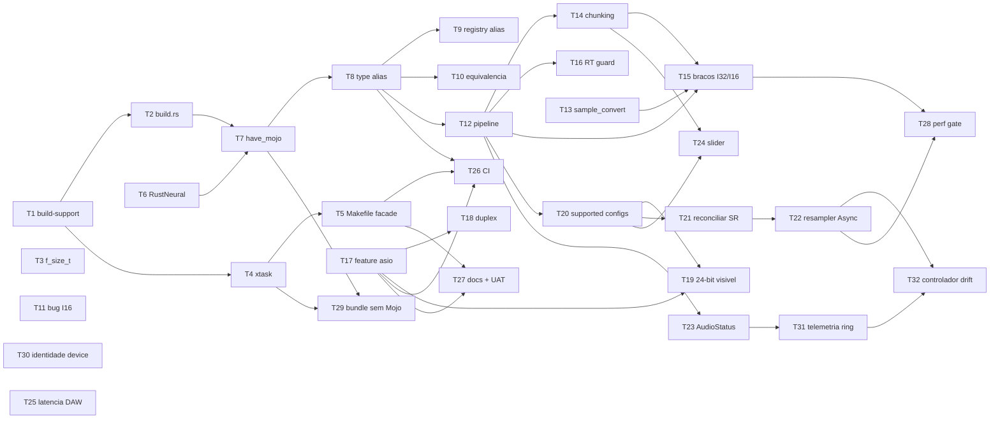

# Cross-Platform Support Tasks

**Design**: `.specs/features/cross-platform/design.md`
**Spec**: `.specs/features/cross-platform/spec.md`
**Status**: Draft (revisão 1 aplicada — 32 tasks, 27 requisitos)

---

## Gate Legend

| Gate | Comando | Quando |
|---|---|---|
| `quick` | `cargo check && cargo test <alvo>` | Tarefas sem impacto no linking |
| `build` | `cargo build --release` (Linux) + `cargo check --target x86_64-pc-windows-msvc` se disponível | Tarefas que tocam `build.rs`, `Cargo.toml` ou headers C |
| `full` | `cargo xtask check-env && cargo build --release && cargo test --release` | Tarefas de áudio e fim de fase |
| `bench` | `cargo bench --bench pipeline -- --baseline main` | Tarefas que tocam a thread de áudio |

`[P]` = paralelizável com as tarefas irmãs da mesma fase.

---

## Execution Plan

### Phase 0: Fundação de Build — desacoplar do Unix

```
T1 (build-support) ──┬──> T2 (build.rs refactor) ──> [Phase 1]
                     └──> T4 (xtask verbs) ──> T5 (Makefile facade)

T3 (f_size_t) ────────── independente
```

### Phase 1: Backend neural por capacidade

```
T6 (RustNeuralProcessor) ──┬──> T7 (build.rs: artefacto + have_mojo + rpath)
                           │         │
T2 ────────────────────────┴─────────┘
                                     └──> T8 (type alias + cfg gating)
                                                │
                                                ├──> T9  (VariantRegistry alias)
                                                └──> T10 (teste de equivalencia)
```

### Phase 2: Correção de áudio (verificável em Linux)

```
T11 (bug drain I16) ──────────── independente

T8 ──> T12 (extrair StandalonePipeline) ──┬──> T14 (chunking, sem truncar)
                                          ├──> T16 (guarda RT-safety)
T13 (sample_convert) ─────────────────────┤
                                          └──> T15 (bracos I32/I16)
                                                    ^
T14 ────────────────────────────────────────────────┘
```

### Phase 3: Windows / ASIO + negociação de configuração

T20 foi movida da Fase 4 para cá: T19 depende dela, e uma aresta a apontar para trás entre fases era
um risco de sequenciamento (recomendação do revisor).

```
T17 (feature asio opt-in) ──┬──> T18 (device duplex unico)
                            └──> T19 (dispositivos 24-bit visiveis)
                                       ^
T12 ──> T20 (SupportedStreamConfigRange) ──┘

T30 (identidade de dispositivo) ──── independente
```

### Phase 4: Robustez do ciclo de vida

```
T20 ──> T21 (reconciliar SR) ──> T22 (resampler Async) ──┐
                                                          ├──> T32 (controlador de drift)
T12 ──> T23 (AudioStatus swap/CAS) ──> T31 (telemetria) ──┘

T14, T20 ──> T24 (semantica do slider)

T25 (latencia ao host DAW) ───── independente
```

### Phase 5: Validação

```
T4, T7 ──────> T29 (bundle forca backend Rust)
T5, T8, T17 ──> T26 (CI matriz 3-OS)
T5, T17 ─────> T27 (docs/BUILD.md + docs/UAT.md)
T15, T22 ────> T28 (gate de performance)
```

### Grafo completo



---

## Task Breakdown

### Phase 0 — Fundação de Build

### T1: Criar crate `build-support`
**What**: Crate sem dependências externas com a descoberta de toolchain e os nomes de artefactos por target.
**Where**: `build-support/Cargo.toml`, `build-support/src/lib.rs`; `Cargo.toml` (adicionar ao `[workspace] members`)
**Depends on**: None
**Reuses**: `build.rs:5-29` (`find_mojo_path`), `scripts/check_env.sh` (lista de caminhos Modular)
**Requirement**: CROSS-01
**Done when**:
- [ ] `which_like(bin)` usa `where.exe` sob `cfg(windows)` e `which` caso contrário
- [ ] `home_dir()` lê `%USERPROFILE%` sob `cfg(windows)` e `$HOME` caso contrário
- [ ] `find_faust()` e `find_mojo()` cobrem PATH → `./.venv/bin/mojo` → `~/.modular/...`
- [ ] `neural_lib_filename(target_os: &str)` devolve `libneural.so` / `libneural.dylib` / `neural.dll` — recebe o SO como **argumento**, não usa `cfg!()`
- [ ] `compile_faust()` e `compile_mojo()` devolvem `Result` com o stderr do compilador em caso de falha
- [ ] `header_state(dsp: &Path, hpp: &Path) -> HeaderState` devolve `Fresh` / `Stale` / `Missing` por comparação de mtime (CROSS-27)
- [ ] `report() -> EnvReport` expõe o que `check_env.sh` imprimia, mais o backend neural efetivo
- [ ] Gate check: `cargo test -p build-support`
**Tests**: unit — co-located em `build-support/src/lib.rs`; tabela de `neural_lib_filename` para os 3 SOs; `which_like("cargo")` devolve `Some`; `header_state` com pares de mtime sintéticos cobre `Fresh`, `Stale` e `Missing`
**Gate**: quick

### T2: Reescrever `build.rs` sobre `build-support`; tornar Faust opcional
**What**: `build.rs` deixa de invocar `which` e `$HOME` diretamente e deixa de fazer panic quando o Faust está ausente mas os `.hpp` versionados existem.
**Where**: `build.rs`, `Cargo.toml` (`[build-dependencies] build-support = { path = "build-support" }`)
**Depends on**: T1
**Reuses**: `build-support`, `dsp/FaustModule.hpp` e `dsp/MlcZeroVModule.hpp` (ambos versionados em git)
**Requirement**: CROSS-01, CROSS-27
**Done when**:
- [ ] `pre_build_check()` já não faz `.expect()` sobre `find_mojo_path()` — Mojo ausente é condição normal
- [ ] Faust ausente, `.hpp` presentes **e mtime `.hpp` ≥ mtime `.dsp`** → `cargo:warning` e prossegue
- [ ] Faust ausente e **mtime `.dsp` > mtime `.hpp`** → `panic!` nomeando o par de ficheiros (CROSS-27: um header obsoleto compilaria DSP errado sem sinal)
- [ ] Faust ausente **sem** `.hpp` presentes → `panic!` nomeando o SO e o comando de instalação
- [ ] Mojo presente mas `compile_mojo()` falha → `panic!` com o stderr (falha ≠ ausência)
- [ ] `build.rs` lê `DISTORTION_FORCE_RUST_NEURAL` e emite `cargo:rerun-if-env-changed` para ela (consumido em T7/T29)
- [ ] `grep -n 'Command::new("which")' build.rs` devolve vazio
- [ ] Gate check: `PATH=/usr/bin:/bin cargo build --release` num shell onde `faust` não está em `PATH` — **sem mover ficheiros do sistema**
**Tests**: unit — a decisão testável (`HeaderState::{Fresh, Stale, Missing}` a partir de dois `SystemTime`) vive em `build-support` (T1) e é testada lá com mtimes sintéticos; `build.rs` apenas a consome
**Gate**: build
**Nota de revisão**: o gate anterior (`mv $(which faust) /tmp/`) era destrutivo e POSIX-only — mutava o
sistema do developer e não corria em Windows. Substituído por manipulação de `PATH` no processo filho.

### T3: `f_size_t` → `size_t` nos dois wrappers C [P]
**What**: Corrigir o typedef LLP64 em **ambos** os headers do wrapper Faust.
**Where**: `dsp/wrapper.h:5`, `dsp/mlc_zero_v_wrapper.h:4`
**Depends on**: None
**Reuses**: nada
**Requirement**: CROSS-05
**Done when**:
- [ ] Ambos os ficheiros: `#include <stddef.h>` + `typedef size_t f_size_t;`
- [ ] O comentário obsoleto sobre "evitar Clang issues de sysroot" é removido
- [ ] `bindgen` continua a gerar `usize` no lado Rust (verificar `$OUT_DIR/bindings_faust.rs` e `bindings_mlc_zero_v.rs`)
- [ ] `grep -rn "unsigned long" dsp/` devolve vazio
- [ ] Gate check: `cargo build --release && cargo test`
**Tests**: unit — `tests/abi.rs`: `assert_eq!(std::mem::size_of::<distortion::bridge::faust::f_size_t>(), 8)` em targets 64-bit
**Gate**: build

### T4: Implementar os verbos do `xtask`
**What**: `xtask` ganha `check-env`, `pre-build`, `build`, `run`, `clean`; `bundle` delega ao upstream.
**Where**: `xtask/src/main.rs`, `xtask/Cargo.toml`, `.cargo/config.toml`
**Depends on**: T1
**Reuses**: `nih_plug_xtask::main_with_args` (`lib.rs:77`), `nih_plug_xtask::chdir_workspace_root` (`lib.rs:158`), `build-support`
**Requirement**: CROSS-21
**Done when**:
- [ ] `main()` faz match sobre `args[0]`; verbos desconhecidos (incl. `bundle`) delegam a `main_with_args("cargo xtask", args)`
- [ ] `run` define `LD_LIBRARY_PATH` (Linux), `DYLD_LIBRARY_PATH` (macOS) ou prepend a `PATH` (Windows) no processo filho
- [ ] `clean` remove `dsp/*.hpp`, `neural/libneural.so`, `neural/libneural.dylib`, `neural/neural.dll` e corre `cargo clean`
- [ ] Nenhum export de `LIBTORCH` / `LIBTORCH_BYPASS_VERSION_CHECK` (não existe dependência `tch` em `Cargo.toml`)
- [ ] `.cargo/config.toml` contém `[alias] xtask = "run --package xtask --release --"`
- [ ] Gate check: `cargo xtask check-env && cargo xtask clean && cargo xtask build`
**Tests**: unit — co-located em `xtask/src/main.rs`: o parser de verbos mapeia cada verbo conhecido e devolve `Delegate` para os restantes
**Gate**: build

### T5: Reduzir `Makefile` a fachada; apagar `scripts/*.sh`
**What**: `Makefile` passa a delegar todos os alvos a `cargo xtask`; os scripts bash são removidos.
**Where**: `Makefile`, `scripts/check_env.sh` (delete), `scripts/run_standalone.sh` (delete)
**Depends on**: T4
**Reuses**: `xtask`
**Requirement**: CROSS-21
**Done when**:
- [ ] Cada alvo do `Makefile` é uma única linha `cargo xtask <verbo>`
- [ ] `Makefile` já não contém `command -v`, `export LD_LIBRARY_PATH`, `export MOJO_HOME`, `export LIBTORCH`
- [ ] `scripts/` está vazio ou removido; `git ls-files scripts/` devolve vazio
- [ ] `README` e `CLAUDE.md` referem `cargo xtask` como caminho canónico, com `make` mencionado como atalho Unix
- [ ] Gate check: `make build && make clean && make check-env`
**Tests**: none — alterações de invocação, cobertas pelo gate
**Gate**: build

---

### Phase 1 — Backend neural por capacidade

### T6: Implementar `RustNeuralProcessor`
**What**: Port literal da saturação tanh polinomial do Mojo para Rust puro.
**Where**: `src/bridge/neural_rust.rs` (novo), `src/bridge/mod.rs` (declarar módulo)
**Depends on**: None
**Reuses**: `neural/main.mojo:30-42` (algoritmo), `src/bridge/mojo.rs:75-99,141-159` (ids de parâmetro e `ParameterMeta`, copiados verbatim)
**Requirement**: CROSS-03
**Done when**:
- [ ] `impl ExternalProcessor for RustNeuralProcessor` com `init`, `process_block`, `get_param`, `set_param`, `param_metadata`
- [ ] `impl DspVariant` sob `#[cfg(feature = "lab")]`, espelhando `mojo.rs:103-131`
- [ ] Os ids aceites são exatamente `drive`/`neural_drive` e `output_gain`/`neural_output_gain`
- [ ] O loop faz `clamp(-4.0, 4.0)` e `x*(27.0+x²)/(27.0+9.0*x²)`, com `#[inline]`
- [ ] `process_block` não aloca: sem `Vec`, `Box`, `collect`, `to_vec`
- [ ] Gate check: `cargo test --lib bridge::neural_rust`
**Tests**: unit — co-located `#[cfg(test)] mod tests` em `neural_rust.rs` (segue a convenção de `mojo.rs:161`): round-trip de parâmetros; `process_block` com `drive=0` produz silêncio; entrada `±10.0` satura sem `NaN`
**Gate**: quick

### T7: `build.rs` — artefacto neural por target, `have_mojo`, linking e `-rpath`
**What**: Nome/extensão da lib derivados do target, emissão de `cfg(have_mojo)`, linking e `-rpath` condicionais.
**Where**: `build.rs`, `.gitignore` (ou `neural/.gitignore`)
**Depends on**: T2, T6
**Reuses**: `build_support::neural_lib_filename`
**Requirement**: CROSS-02, CROSS-19, CROSS-20
**Done when**:
- [ ] O output do Mojo é `neural/{neural_lib_filename(CARGO_CFG_TARGET_OS)}`
- [ ] `println!("cargo::rustc-check-cfg=cfg(have_mojo)")` é emitido **sempre** (evita o lint `unexpected_cfgs`)
- [ ] `println!("cargo::rustc-cfg=have_mojo")` é emitido **apenas** quando o toolchain foi encontrado e a compilação teve sucesso
- [ ] `cargo:rustc-link-lib=neural` (sem a keyword `dylib`) e `cargo:rustc-link-search` só sob `have_mojo`
- [ ] `-Wl,-rpath,{neural_dir}` emitido para `linux` **e** `macos`
- [ ] `.gitignore` cobre `neural/*.so`, `neural/*.dylib`, `neural/*.dll`
- [ ] Gate check: `cargo build --release` com e sem `mojo` no PATH; `nm -D target/release/libdistortion.so | grep mojo_process_block` presente só no primeiro caso
**Tests**: none — validado pelo gate (a lógica de nomes é testada em T1)
**Gate**: build

### T8: Alias de backend e gating de `cfg` do módulo Mojo
**What**: `NeuralProcessor` resolve por capacidade; o módulo `mojo` e o seu bloco `extern "C"` desaparecem quando o Mojo está ausente.
**Where**: `src/bridge/mod.rs`, `src/bridge/mojo.rs`, `src/lib.rs`, `src/bin/standalone.rs:748-757`
**Depends on**: T6, T7
**Reuses**: `src/bridge/mojo.rs`
**Requirement**: CROSS-03
**Done when**:
- [ ] `pub mod mojo;` está sob `#[cfg(have_mojo)]`
- [ ] `pub type NeuralProcessor` = `MojoProcessor` sob `have_mojo`, `RustNeuralProcessor` caso contrário
- [ ] Nenhum `#[cfg(target_os = ...)]` decide o backend neural (`grep -rn 'cfg(target_os' src/bridge/` → vazio)
- [ ] Todos os call-sites usam `NeuralProcessor`, não `MojoProcessor` diretamente
- [ ] Gate check: `cargo build --release` com Mojo ausente do PATH liga sem símbolos `mojo_*` por resolver
**Tests**: unit — co-located em `src/bridge/mod.rs`: `NeuralProcessor::new()` constrói e `init(48000.0)` marca `is_ready`
**Gate**: build

### T9: `VariantRegistry` resolve `mojo-neural` por alias
**What**: O impl id `"mojo-neural"` persistido em `lab.db` resolve para o backend disponível, em qualquer SO.
**Where**: `src/lab/` (registry), `src/bridge/neural_rust.rs` (factory)
**Depends on**: T8
**Reuses**: `src/bridge/mojo.rs:134` (`mojo_neural_factory`)
**Requirement**: CROSS-03
**Done when**:
- [ ] `"mojo-neural"` permanece o id canónico registado, independentemente do backend
- [ ] `ParameterMeta` ganha `backend: Option<&'static str>` (`"mojo"` | `"rust"`), não serializado
- [ ] Um `lab.db` com nós `mojo-neural` carrega sem erro quando `have_mojo` está desativado
- [ ] Um impl id genuinamente desconhecido cai para passthrough + log, sem falhar o carregamento
- [ ] Gate check: `cargo test --test lab_integration`
**Tests**: integration — `tests/lab_integration.rs` (convenção existente para a camada `lab`): semear um `lab.db` com `mojo-neural`, carregar sob ambos os `cfg`, afirmar que os valores de `drive`/`output_gain` do snapshot são preservados
**Gate**: full

### T10: Teste de equivalência numérica Mojo ↔ Rust
**What**: Provar que os dois backends produzem a mesma saída dentro de 1e-6.
**Where**: `tests/neural_equivalence.rs` (novo)
**Depends on**: T8
**Reuses**: `MojoProcessor`, `RustNeuralProcessor`
**Requirement**: CROSS-04
**Done when**:
- [ ] O teste está sob `#![cfg(have_mojo)]` — só corre onde ambos os backends existem
- [ ] Varre `drive ∈ {0.0, 0.5, 1.0, 2.0, 8.0}` × `output_gain ∈ {0.0, 0.5, 1.0, 2.0}`
- [ ] Sinais de entrada: rampa `[-2.0, 2.0]`, ruído branco com seed fixa, DC `±1.0`, e os valores exatos `±4.0` (fronteira do clamp)
- [ ] Afirma `max |mojo[i] - rust[i]| <= 1e-6` e que nenhuma saída é `NaN`/`inf`
- [ ] `tests/neural_equivalence.rs` é ignorado silenciosamente (não falha) em Windows
- [ ] Gate check: `cargo test --test neural_equivalence` em Linux
**Tests**: integration — requer o `.so` do Mojo em runtime, logo não pode ser unit test co-located
**Gate**: full

---

### Phase 2 — Correção de áudio

### T11: Corrigir o drain do ring buffer no braço I16 de saída [P]
**What**: O braço `I16` retira duas amostras por frame (L e R), como o braço `F32`.
**Where**: `src/bin/standalone.rs:1236-1253`
**Depends on**: None
**Reuses**: o braço `F32` em `standalone.rs:1214-1233` como referência
**Requirement**: CROSS-08
**Done when**:
- [ ] O braço `I16` faz `(pc.pop(), pc.pop())` e escreve `l_sample` em `l_idx` e `r_sample` em `r_idx`
- [ ] A conversão usa `sample_convert::f32_to_i16` (clamp antes da escala) — ver T13; até T13 aterrar, um clamp inline
- [ ] Gate check: `cargo test --lib ring_drain`
**Tests**: unit — co-located: empurrar `2N` amostras, consumir `N` frames pelo braço I16, afirmar `consumer.slots() == 0`
**Gate**: quick
**Nota**: Independente de tudo o resto e corrige um bug audível em Linux hoje. Deve ser o primeiro commit a aterrar em `main`.

### T12: Extrair `StandalonePipeline` — sem alteração de comportamento
**What**: Mover as ~400 linhas de pipeline DSP inline do callback para uma struct pré-alocada.
**Where**: `src/core/dsp/standalone_pipeline.rs` (novo), `src/bin/standalone.rs:775-1190`
**Depends on**: T8
**Reuses**: `src/bin/standalone.rs:775-1190` — corpo movido, não reescrito
**Requirement**: CROSS-07, CROSS-22
**Done when**:
- [ ] `StandalonePipeline::new(sample_rate, max_block)` aloca `temp_l`, `temp_r`, `crossfade_buf` e constrói Faust/MLC/Neural/Cabinet
- [ ] `process(&mut self, l: &mut [f32], r: &mut [f32])` contém zero `Vec::new`, `vec![]`, `Box::new`, `collect`, `to_vec`, `lock()`
- [ ] `debug_assert!(l.len() == r.len() && l.len() <= self.max_block)`
- [ ] O callback F32 existente chama `pipeline.process(...)` e nada mais mudou
- [ ] Este commit é **puramente** uma extração: `git diff` não mostra alterações de aritmética
- [ ] **Matriz de golden vectors** capturada em `main` pré-refactor e reproduzida bit-a-bit (`max |Δ| == 0.0`, comparação de bits `to_bits()`, não `==`, para apanhar `-0.0` e `NaN`):

  | Modo | Configuração |
  |---|---|
  | Passthrough | todos os estágios em bypass |
  | EQ only | Faust ativo, neural/MLC/cabinet em bypass |
  | Neural only | neural ativo, `drive ∈ {0.5, 2.0, 8.0}` |
  | MLC only | MLC ZERO V ativo |
  | Cabinet on / off | convolução ativa e inativa |
  | Crossfade | durante a transição entre amps (o caminho de `crossfade_buf`) |
  | Limiter on / off | ambos os estados |
  | Bloco zero | `l.len() == 0` → no-op, sem panic |
  | Bloco parcial | `l.len() == 1` e `l.len() == max_block` (fronteiras) |
- [ ] Cada modo é exercido com: rampa, ruído branco com seed fixa, DC `±1.0`, silêncio, e um sinal que satura (`±10.0`)
- [ ] Gate check: `cargo test --test pipeline_golden` — 0 diferenças em todos os modos
**Tests**: integration — `tests/pipeline_golden.rs` com os vetores de referência em `tests/fixtures/`; unit co-located em `standalone_pipeline.rs` para o bloco de 0 amostras e os `debug_assert`
**Gate**: full + bench
**Nota de revisão**: o gate anterior ("render de 10 s de um WAV") só exercia o caminho default, deixando
crossfade, bypass e cabinet sem cobertura — precisamente onde uma extração mecânica erra.

### T13: Módulo `sample_convert` [P]
**What**: Conversões `I32`/`I16` ↔ `f32` normalizado, na fronteira do driver.
**Where**: `src/core/dsp/sample_convert.rs` (novo)
**Depends on**: None
**Reuses**: nada
**Requirement**: CROSS-07
**Done when**:
- [ ] `i32_to_f32`, `i16_to_f32`, `f32_to_i32`, `f32_to_i16`, todas `#[inline(always)]`
- [ ] `i32_to_f32` divide por `i32::MAX as f64` (não por `abs(i32::MIN)`) e faz o cálculo em `f64`
- [ ] `f32_to_i32` e `f32_to_i16` fazem `clamp(-1.0, 1.0)` **antes** da escala — sem clamp, `+1.0` faria wraparound para `i32::MIN` (um clique audível)
- [ ] Gate check: `cargo test --lib sample_convert`
**Tests**: unit — co-located: `i32_to_f32(i32::MAX) == 1.0`; `i32_to_f32(i32::MIN)` ∈ `[-1.0 - 1e-9, -1.0]`; `f32_to_i16(2.0) == i16::MAX`; `f32_to_i16(-2.0) == i16::MIN + 1`; round-trip `i16 → f32 → i16` é identidade

**Gate**: quick

### T14: Processamento em blocos — nunca truncar, nunca realocar
**What**: Substituir `min(num_frames, buffer_size)` por um loop de chunks sobre capacidade pré-alocada.
**Where**: `src/bin/standalone.rs:890-893` e o callback de input
**Depends on**: T12
**Reuses**: `StandalonePipeline::max_block()`
**Requirement**: CROSS-09, CROSS-22
**Done when**:
- [ ] `max_len = num_frames.min(buffer_size)` é removido; `num_frames` = frames **completos** (`data.len() / channels`)
- [ ] O callback itera `for chunk_start in (0..num_frames).step_by(cap)`
- [ ] Nenhuma chamada a `ensure_buffer_capacity` nem equivalente **dentro** do callback (alocaria na thread de áudio)
- [ ] `max_block` é dimensionado em `ApplyRouting`, com fallback de 8192
- [ ] O ring buffer de playthrough é dimensionado a partir do bloco real observado, não do slider
- [ ] Gate check: alimentar um bloco de 4096 frames com `max_block = 512` e afirmar 4096 frames processados
**Tests**: unit — co-located em `standalone_pipeline.rs`: `process_chunked(4096 frames, cap=512)` produz 4096 amostras de saída, contadas
**Gate**: full + bench

### T15: Braços `I32` e `I16` no stream de entrada
**What**: Aceitar os formatos nativos dos drivers ASIO/WASAPI, convertendo na fronteira.
**Where**: `src/bin/standalone.rs:775` (match de `sample_format`)
**Depends on**: T12, T13, T14
**Reuses**: `StandalonePipeline`, `sample_convert`
**Requirement**: CROSS-07
**Done when**:
- [ ] Os três braços (`F32`, `I32`, `I16`) desentrelaçam, convertem e chamam a **mesma** `pipeline.process()`
- [ ] Zero duplicação do pipeline: `grep -c "cabinet_engine" src/bin/standalone.rs` não aumenta
- [ ] `_ => Err(StreamConfigNotSupported)` mantém-se para formatos genuinamente não suportados (`U8`, `I64`, `F64`)
- [ ] Nenhuma alocação em nenhum dos três braços
- [ ] Gate check: `cargo test --test format_equivalence`
**Tests**: integration — `tests/format_equivalence.rs`: o mesmo sinal, entregue como `F32`, `I32` e `I16`, produz saídas que coincidem dentro do erro de quantização de cada formato (`2^-31`, `2^-15`)
**Gate**: full + bench

### T16: Guarda de regressão de RT-safety
**What**: Um teste que falha se `StandalonePipeline::process` alocar.
**Where**: `tests/rt_safety.rs` (novo)
**Depends on**: T12
**Reuses**: `nih_plug` `assert_process_allocs` (já ativo em `Cargo.toml:25`)
**Requirement**: CROSS-22
**Done when**:
- [ ] Um `GlobalAlloc` de teste conta alocações; `process()` num loop de 1000 blocos regista contagem zero
- [ ] O teste cobre os três formatos de entrada e o caminho com resampler ativo (após T22)
- [ ] `assert_process_allocs` permanece ativo nas features do `nih_plug`
- [ ] Gate check: `cargo test --test rt_safety --release`
**Tests**: integration — requer um allocator global, o que exclui unit test co-located
**Gate**: full

---

### Phase 3 — Windows / ASIO

### T17: ASIO como feature Cargo opt-in [P]
**What**: `cpal` target-gated a Windows; `asio` é uma feature explícita, não default.
**Where**: `Cargo.toml:22`
**Depends on**: None
**Reuses**: nada
**Requirement**: CROSS-06
**Done when**:
- [ ] `[target.'cfg(target_os = "windows")'.dependencies] cpal = { version = "0.15.2" }`
- [ ] `[target.'cfg(not(target_os = "windows"))'.dependencies] cpal = "0.15.2"`
- [ ] `[features] asio = ["cpal/asio"]` — **não** incluída em `default`
- [ ] `cargo build` em Windows compila contra WASAPI sem `ASIO_DIR` nem `LIBCLANG_PATH`
- [ ] `cargo build --features asio` em Windows compila com ambas as variáveis definidas
- [ ] Gate check: `cargo check --no-default-features --features lab` e `cargo check` em Linux (nenhum deve puxar `asio-sys`)
**Tests**: none — configuração de build, coberta pelo gate e pela CI (T26)

**Gate**: build

### T18: ASIO duplex — um único `cpal::Device`
**What**: Quando o host é ASIO, input e output partilham a mesma instância de `Device`.
**Where**: `src/bin/standalone.rs:761-764`, `1200-1203`
**Depends on**: T17
**Reuses**: `audio_worker::ApplyRouting`
**Requirement**: CROSS-15
**Done when**:
- [ ] Sob `#[cfg(feature = "asio")]` e `host_id == HostId::Asio`, um `Device` é obtido uma vez e ambos os streams são construídos a partir dele
- [ ] Nos outros hosts, o comportamento atual (dois `Device`) é preservado
- [ ] Se o nome do dispositivo de input ≠ output em ASIO, a UI exibe um aviso e usa o do output
- [ ] Gate check: `cargo check --features asio --target x86_64-pc-windows-msvc` (ou o job de CI)
**Tests**: none — requer hardware ASIO; verificado manualmente e documentado em `docs/BUILD.md`
**Gate**: build
**Risco**: Não verificável em Linux. Marcar o PR como "carece de verificação em hardware Windows".

### T20: Negociação via `SupportedStreamConfigRange`
**What**: Escolher a configuração a partir das capacidades reais do driver, não do default.
**Where**: `src/bin/standalone.rs:766`, `1180` (`default_*_config`)
**Depends on**: T12
**Reuses**: `cpal::Device::supported_input_configs()` / `supported_output_configs()`
**Requirement**: CROSS-11
**Done when**:
- [ ] `pick_config(device, dir)` filtra por `F32 | I32 | I16` e escolhe a sample rate mais próxima da do default
- [ ] `max_block` do `StandalonePipeline` deriva de `range.buffer_size()`, com fallback de 8192
- [ ] `default_*_config()` permanece como fallback quando `supported_*_configs()` devolve `Err` ou vazio
- [ ] Gate check: `cargo test --lib pick_config`
**Tests**: unit — co-located: dado um conjunto sintético de `SupportedStreamConfigRange`, `pick_config` prefere `F32` sobre `I32` sobre `I16` à mesma sample rate
**Gate**: quick
**Nota de revisão**: movida da Fase 4 para a Fase 3. T19 depende dela (precisa de `supported_formats`),
e uma aresta a apontar para trás entre fases era um risco de sequenciamento desnecessário.

### T30: Identidade de dispositivo estável [P]
**What**: Distinguir dispositivos homónimos por índice de enumeração, não por comparação de `String`.
**Where**: `src/bin/standalone.rs:770`, `1177` (`find(|d| d.name() == raw_name)`), `DeviceContext`
**Depends on**: None
**Reuses**: `DeviceContext.raw_name`
**Requirement**: CROSS-25
**Done when**:
- [ ] `DeviceContext` ganha `enum_index: usize`, preenchido durante `refresh_devices`
- [ ] O lookup em `ApplyRouting` usa `.nth(enum_index)` e **valida** o nome; se não corresponder, cai para busca por nome
- [ ] `grep -n 'find(|d| d.name()' src/bin/standalone.rs` devolve vazio
- [ ] Nenhuma mudança é feita para "suporte Unicode": `cpal::Device::name()` já devolve `String` (UTF-8)
- [ ] Gate check: `cargo test --lib device_identity`
**Tests**: unit — co-located: dada uma lista sintética com dois dispositivos de nome idêntico, selecionar `enum_index: 1` devolve o segundo; se o dispositivo em `enum_index` mudou de nome, o fallback por nome encontra-o
**Gate**: quick
**Nota de revisão**: aceite parcialmente. A parte "duplicados" é um bug real e presente. A parte
"Unicode" foi rejeitada — não há `OsString` nem code page ANSI no caminho.

### T19: Dispositivos com formato não suportado permanecem visíveis
**What**: Um dispositivo ASIO 24-bit aparece na lista, marcado como inutilizável, em vez de desaparecer.
**Where**: `src/bin/standalone.rs:677`, `699` (`refresh_devices`), `DeviceContext`
**Depends on**: T17, T20
**Reuses**: `DeviceContext`, `supported_input_configs()`
**Requirement**: CROSS-16
**Done when**:
- [ ] `DeviceContext` ganha `supported_formats: Vec<SampleFormat>` e `usable: bool`
- [ ] `default_input_config()` a devolver `Err` já não faz `continue` — o dispositivo é listado com `usable: false`
- [ ] O ComboBox desativa as entradas `usable: false` e mostra a razão no tooltip
- [ ] Gate check: `cargo test --lib device_listing`
**Tests**: unit — co-located: `DeviceContext` construído a partir de um `Err` de config tem `usable == false` e nome preservado
**Gate**: quick

---

### Phase 4 — Robustez do ciclo de vida

### T21: Reconciliar sample rates de input e output
**What**: Escolher uma sample rate comum ou eleger o output como master.
**Where**: `src/bin/standalone.rs:1494-1506`
**Depends on**: T20
**Reuses**: `pick_config` (T20), `sample_rate_warning`
**Requirement**: CROSS-12
**Done when**:
- [ ] Se existir uma sample rate suportada por ambos, é usada em ambos os streams
- [ ] Caso contrário, a do output torna-se master e um flag `needs_resampling` é definido
- [ ] Faust, MLC, Neural e Cabinet são inicializados com a sample rate **efetiva** (a do output)
- [ ] O aviso da UI passa de "taxas incompatíveis" a "resampling ativo: 44100 → 48000 Hz"
- [ ] Gate check: `cargo test --lib reconcile_sample_rate`
**Tests**: unit — co-located: conjuntos com interseção → sample rate comum; sem interseção → SR do output + `needs_resampling == true`
**Gate**: quick

### T22: Resampler em tempo real (`rubato::Async`)
**What**: Inserir um resampler assíncrono ajustável no caminho de entrada quando `needs_resampling`.
**Where**: `src/core/dsp/rt_resampler.rs` (novo), callback de input
**Depends on**: T21
**Reuses**: `rubato 1.0.1` (`Cargo.toml:31`), `src/core/cabinet/runtime.rs:4` (padrão de uso já estabelecido)
**Requirement**: CROSS-13, CROSS-22
**Done when**:
- [ ] Usa `Async::<f32>::new_sinc(ratio, 1.05, &params, chunk_size, 2, FixedAsync::Input)` — **não** `FftFixedInOut` nem `SincFixedInOut`, que não existem em `rubato 1.0.1` (`lib.rs:56,64` exporta `Async`/`FixedAsync` e `Fft`/`FixedSync`)
- [ ] **Não** usa `Fft`: devolve `Err(SyncNotAdjustable)` em `set_resample_ratio_relative` (`synchro.rs:616`), impossibilitando T32
- [ ] Construído em `ApplyRouting` e **movido** para dentro da closure — nunca construído no callback
- [ ] **Staging buffer** pré-alocado (capacidade `input_frames_max() + max_block`) desacopla o tamanho do callback do tamanho do chunk exigido por `FixedAsync::Input`:
  - acumular os frames do callback em `staging[staged..]`
  - enquanto `staged >= input_frames_next()`: processar um chunk completo, empurrar para o ring, `copy_within` do leftover para o início, decrementar `staged`
  - o leftover (`< input_frames_next()`) sobrevive para o callback seguinte
- [ ] `Indexing.partial_len` **não** é usado: faz zero-padding do chunk, o que injeta silêncio periódico num stream contínuo (é correto apenas em EOF de um clip offline)
- [ ] `indexing: None` é passado a `process_into_buffer` — um `Indexing` com `active_channels_mask: Some(..)` alocaria (`Option<Vec<bool>>`, `lib.rs:74`)
- [ ] O número de frames empurrado para o ring é o `output_frames` **devolvido** por `process_into_buffer`, nunca um valor derivado do rácio nominal
- [ ] Buffers de output dimensionados por `output_frames_max()`; `process()` (que devolve `Vec`) e `process_all_into_buffer` (para clips) não são usados
- [ ] `output_delay()` **mais** o atraso do staging (até `input_frames_next() - 1` frames) são somados ao valor de CROSS-18
- [ ] 60 s de sinal a 44.1 → 48 kHz com clocks ideais: contagem de amostras dentro de ±1 do esperado
- [ ] Gate check: `cargo test --test rt_safety --release` (T16 estendido) não regista alocações
**Tests**: unit — co-located em `rt_resampler.rs`: (a) contagem total de amostras in/out por rácio — `FixedAsync::Input` dá output de tamanho variável, logo o teste afirma sobre o **total**, não por bloco; (b) **alimentação com blocos de tamanho irregular** (`[100, 3, 512, 1, 977]` frames) produz o mesmo total de output que um único bloco da mesma soma, provando que o staging preserva o leftover; (c) nenhum zero é injetado no interior do stream. Integration em `tests/rt_safety.rs` para zero-alocação
**Gate**: full + bench
**Nota de revisão**: o design original nomeava `FftFixedInOut`, uma API de `rubato 0.x`. A verificação
contra `~/.cargo/registry/src/.../rubato-1.0.1/` mostrou que não existe, e que o substituto óbvio
(`Fft`) recusa ajustes de rácio — o que forçaria o abandono de T32.

### T23: `AudioStatus` lock-free + hot-plug
**What**: Erros de stream chegam à UI sem alocar e sem race; botão "Refresh Devices".
**Where**: `src/core/audio_status.rs` (novo), `src/bin/standalone.rs` (`error_callback`, UI)
**Depends on**: T12
**Reuses**: `AudioCommand::RefreshDevices` (já existe, `standalone.rs:670`)
**Requirement**: CROSS-10, CROSS-22
**Done when**:
- [ ] `AudioStatus { code: AtomicU8, dropped_errors: AtomicU32, underruns: AtomicU64, overflows: AtomicU64 }` partilhado por `Arc`
- [ ] `take_error()` usa `code.swap(NO_ERROR, AcqRel)` — **uma** operação atómica. Um `load` seguido de `store` perderia qualquer erro escrito entre as duas
- [ ] `set_error(kind)` usa `compare_exchange(NO_ERROR, kind, AcqRel, Acquire)`; se falhar (já há erro pendente) incrementa `dropped_errors` — o **primeiro** erro vence, para preservar a causa raiz em vez do sintoma
- [ ] O campo `generation` é omitido: `swap` torna-o redundante
- [ ] `AudioEvent::StreamError(String)` **não** é adicionado ao enum (alocaria na thread de áudio)
- [ ] A UI faz poll de `take_error()` por frame e exibe "primeiro erro: X (+N subsequentes)"
- [ ] Um botão "Refresh Devices" junto ao ComboBox de Driver emite `AudioCommand::RefreshDevices`
- [ ] Gate check: `cargo test --lib audio_status && cargo test --lib audio_status -- --test-threads=1`
**Tests**: unit — co-located em `audio_status.rs`: round-trip `set_error`/`take_error`; `take_error` num estado limpo devolve `None`; **teste de concorrência**: 8 threads a chamar `set_error` enquanto uma chama `take_error` em loop — a soma de `take_error` que devolveram `Some` mais `dropped_errors` iguala o número total de `set_error`, provando que nenhum erro é perdido
**Gate**: full
**Nota de revisão**: a lacuna 1 do revisor está correta e o teste de concorrência acima é o que a
teria apanhado.

### T24: Slider de latência reflete o buffer real do driver
**What**: `buffer_power` deixa de fingir controlar o driver; a UI mostra o buffer observado.
**Where**: `src/bin/standalone.rs:1383` (slider), `1526` (`buffer_size: 1 << self.buffer_power`)
**Depends on**: T14, T20
**Reuses**: `max_block` observado (T14), `pick_config` (T20)
**Requirement**: CROSS-14
**Done when**:
- [ ] Um label informativo exibe "Driver buffer: N samples @ SR Hz = X.X ms", derivado do `num_frames` real
- [ ] O slider é reetiquetado "Folga do ring buffer interno" e deixa de influenciar `max_len`
- [ ] `BufferSize::Default` mantém-se (a Opção B do roadmap — `BufferSize::Fixed`— é rejeitada: o ASIO ignora-a)
- [ ] Gate check: `cargo xtask run` e inspeção visual do label
**Tests**: unit — co-located: `format_latency(256, 48000)` == `"256 samples @ 48000 Hz = 5.3 ms"`
**Gate**: quick

### T25: Reportar latência real ao host DAW [P]
**What**: `set_latency_samples` reporta o valor real e apenas quando muda.
**Where**: `src/lib.rs:998`
**Depends on**: None
**Reuses**: `BufferConfig`, latência do `CabinetEngine` e do resampler
**Requirement**: CROSS-18
**Done when**:
- [ ] A chamada sai de `process()` e passa a `initialize()`
- [ ] O valor é a soma das latências dos estágios (Cabinet FFT + resampler, se ativo); zero para os estágios sem latência
- [ ] Um campo `last_reported_latency: u32` suprime notificações repetidas
- [ ] O comentário "Mojo é síncrono e zero-copy — latência 0" é atualizado (verdadeiro para o Mojo, falso para o pipeline)
- [ ] Gate check: `cargo build --release && cargo xtask bundle`
**Tests**: unit — co-located em `src/lib.rs`: `compute_latency()` soma corretamente com e sem cabinet ativo
**Gate**: build

### T31: Telemetria de overflow/underrun do ring buffer
**What**: Nenhum drop de áudio ocorre sem ser contado.
**Where**: `src/bin/standalone.rs` (callbacks de input e output), `src/core/audio_status.rs`
**Depends on**: T23
**Reuses**: `AudioStatus`
**Requirement**: CROSS-26
**Done when**:
- [ ] Toda a chamada a `producer.push(x)` cujo `Err` era descartado passa a `note_overflow()`
- [ ] Todo o `consumer.pop().unwrap_or(0.0)` que devolve o default passa a `note_underrun()`
- [ ] `grep -n "let _ = .*push(" src/bin/standalone.rs` devolve vazio
- [ ] A UI exibe `underruns` e `overflows` num painel de diagnóstico
- [ ] Ambos os contadores usam `fetch_add(1, Relaxed)` — sem alocação, sem lock
- [ ] Gate check: `cargo test --test rt_safety --release` continua a registar zero alocações
**Tests**: unit — co-located: encher o ring buffer e afirmar `overflows == n_descartados`; drenar um ring vazio e afirmar `underruns == n_pops`
**Gate**: full
**Nota de revisão**: lacuna 8, aceite. D1 mantém o drop como comportamento correto; o que muda é que
deixa de ser invisível — e passa a ser o sinal de entrada do controlador de drift (T32).

### T32: Controlador de drift de clock
**What**: Ajustar continuamente o rácio de resampling em função da ocupação do ring buffer.
**Where**: `src/core/dsp/rt_resampler.rs`, callback de input
**Depends on**: T22, T31
**Reuses**: `Async::set_resample_ratio_relative`, contadores de `AudioStatus`
**Requirement**: CROSS-13, CROSS-22
**Done when**:
- [ ] `trim_ratio(ring_fill)` implementa `ratio_rel = 1.0 - Kp * erro`, com `erro = (ocupação - alvo)/alvo` e `Kp ≈ 1e-4`
- [ ] O **sinal** é justificado por um comentário: o rácio do `rubato` é `output/input` (`lib.rs:195`) e o resampler alimenta o ring, logo `erro > 0` (ring a encher) tem de **reduzir** o rácio
- [ ] Chama `set_resample_ratio_relative(ratio_rel, ramp: true)` — `ramp` evita descontinuidades audíveis
- [ ] O ajuste satura em ±5 % (o `max_resample_ratio_relative = 1.05` passado a `new_sinc`)
- [ ] Saturação sustentada (> 5 s) dispara `AudioStatus::set_error(ClockDriftUnrecoverable)`
- [ ] `set_resample_ratio_relative` não aloca (só atualiza estado interno) — verificado por T16
- [ ] Gate check: `cargo test --test clock_drift --release`
**Tests**: integration — `tests/clock_drift.rs`, offline, sem hardware. **Ambas as direções de drift são obrigatórias**:
  - input rápido: clock de input a `44100 × (1 + 100e-6)` contra output a 48000 → ring tende a encher
  - input lento: clock de input a `44100 × (1 - 100e-6)` → ring tende a esvaziar
  - em ambos, 10 min de áudio: ocupação do ring dentro de ±10 % do alvo, `overflows == 0 && underruns == 0`
  - teste negativo: com o sinal invertido (`1 + Kp*erro`), o teste **tem** de falhar — caso contrário não está a medir nada
**Gate**: full + bench
**Nota de revisão**: lacuna 4 e D3. Sem esta task, `needs_resampling` corrige o desvio **nominal** e
ignora o desvio **real** entre cristais — o modo de falha exato que o revisor descreveu para macOS com
dispositivos de input e output distintos. O sinal do controlador foi corrigido na revisão 2: um
controlador com o sinal trocado **diverge** (o ring enche mais depressa quanto mais cheio está) e
passaria trivialmente um teste que só exercesse uma direção de drift — daí as duas direções acima.

---

### Phase 5 — Validação

### T29: Bundles de release forçam o backend Rust
**What**: `cargo xtask bundle` produz binários auto-contidos, sem dependência de `libneural.*`.
**Where**: `xtask/src/main.rs`, `build.rs`
**Depends on**: T4, T7
**Reuses**: `have_mojo` (T7), `DISTORTION_FORCE_RUST_NEURAL` (T2)
**Requirement**: CROSS-24
**Done when**:
- [ ] `xtask bundle` define `DISTORTION_FORCE_RUST_NEURAL=1` antes de delegar a `nih_plug_xtask::main_with_args`
- [ ] `build.rs` com essa variável presente **não** emite `have_mojo` nem diretivas de linking, mesmo com o Mojo instalado
- [ ] `cargo:rerun-if-env-changed=DISTORTION_FORCE_RUST_NEURAL` é emitido
- [ ] `cargo test` num build de dev encontra a lib via `-rpath`, sem `LD_LIBRARY_PATH` no ambiente
- [ ] `docs/BUILD.md` regista que Mojo é toolchain de desenvolvimento, não de distribuição
- [ ] Gate check: `cargo xtask bundle distortion --release && ldd target/bundled/**/*.so | grep -c neural` devolve `0` (Linux); `otool -L` equivalente em macOS
**Tests**: integration — `tests/bundle_deps.rs`, marcado `#[ignore]` (corre só na CI): invoca a ferramenta de dependências da plataforma sobre o artefacto do bundle e afirma ausência de `libneural`
**Gate**: build
**Nota de revisão**: lacuna 3, resolvida por eliminação (D4) em vez de por um mecanismo de descoberta
em runtime. O `-rpath` de T7 passa a servir apenas dev e `cargo test`.

### T26: CI matriz de 3 SOs
**What**: GitHub Actions valida build e testes em Linux, Windows e macOS.
**Where**: `.github/workflows/ci.yml` (novo)
**Depends on**: T5, T8, T17
**Reuses**: `cargo xtask check-env`
**Requirement**: CROSS-17
**Done when**:
- [ ] Matriz `[ubuntu-latest, macos-latest, windows-latest]` corre `cargo build --release` e `cargo test --release`
- [ ] Faust instalado via `apt`/`brew`; **não** instalado no Windows (os `.hpp` versionados cobrem-no — ver T2)
- [ ] Mojo instalado apenas no `ubuntu-latest`; os outros jobs validam o caminho `not(have_mojo)`
- [ ] Windows define `LIBCLANG_PATH` para o `bindgen`
- [ ] Um job extra `windows + --features asio`, com `continue-on-error: true` até o ASIO SDK estar cacheado
- [ ] `cargo fmt --check` e `cargo clippy -- -D warnings` correm no job Linux
- [ ] Gate check: abrir um PR e obter 3 jobs verdes
**Tests**: none — o workflow é a própria verificação
**Gate**: full

### T27: `docs/BUILD.md` — pré-requisitos por plataforma
**What**: Documentar toolchain, variáveis de ambiente e o caminho `cargo xtask` para as 3 plataformas.
**Where**: `docs/BUILD.md` (novo), `README.md`, `CLAUDE.md`
**Depends on**: T5, T17
**Reuses**: `docs/CROSS_PLATFORM_ROADMAP.md` (secção de pré-requisitos de B5)
**Requirement**: CROSS-23
**Done when**:
- [ ] Linux: `faust`, `mojo` (opcional), `clang`
- [ ] macOS: `brew install faust llvm`, Mojo opcional, nota sobre Apple Silicon vs Intel
- [ ] Windows: MSVC Build Tools, LLVM + `LIBCLANG_PATH`, Faust opcional (`.hpp` versionados), ASIO SDK + `ASIO_DIR` só para `--features asio`
- [ ] Tabela de qual backend neural é usado em cada plataforma e como o confirmar (`cargo xtask check-env`), incl. a nota de que **releases usam sempre Rust** (D2/D4)
- [ ] `CLAUDE.md` — a secção "Build & Dev Commands" passa a `cargo xtask`
- [ ] **Guião de UAT manual** (`docs/UAT.md`), porque nada disto é verificável em CI:
  - macOS/CoreAudio: dispositivo único; input e output **físicos distintos** (drift real); um **aggregate device**; hot-unplug durante reprodução
  - Windows/WASAPI: modo partilhado e exclusivo; hot-unplug
  - Windows/ASIO: interface real (I32); duas interfaces homónimas (valida T30); driver 24-bit (valida T19); duplex a partir de um só `Device` (valida T18)
  - Cada cenário regista: `underruns`, `overflows`, e se o banner de erro apareceu
- [ ] Gate check: um developer segue o documento numa máquina limpa de cada SO
**Tests**: none — o guião de UAT é a verificação
**Gate**: quick
**Nota de revisão**: o revisor está certo em que macOS/CoreAudio foi tratado com otimismo. T18, T19,
T30 e T32 têm modos de falha que só aparecem em hardware real; `docs/UAT.md` torna essa dívida
explícita em vez de a deixar implícita.

### T28: Gate de performance do pipeline
**What**: Provar que a portabilidade não custou latência nem throughput.
**Where**: `benches/pipeline.rs` (novo), `.github/workflows/ci.yml`
**Depends on**: T15, T22
**Reuses**: `StandalonePipeline`
**Requirement**: CROSS-22
**Done when**:
- [ ] Baseline capturado no commit de `main` anterior a T1
- [ ] `cargo bench --bench pipeline` mede `process()` a 64, 256, 1024 e 4096 frames
- [ ] Nenhuma configuração regride mais de 2 % face ao baseline
- [ ] O backend Rust é medido contra o Mojo em Linux; a diferença é registada em `docs/BUILD.md` (informativa, não um gate)
- [ ] `tests/rt_safety.rs` (T16) regista zero alocações em todos os caminhos, incl. resampler
- [ ] Gate check: `cargo bench --bench pipeline -- --baseline main`
**Tests**: bench — `benches/`
**Gate**: bench

---

## Pre-Approval Checks

### Task Granularity Check

Critério: uma tarefa é atómica se produz um commit único, reversível, com um gate verificável.

| Task | Scope | Status |
|---|---|---|
| T1 | 1 crate novo, 6 funções, sem consumidores | ✓ Atómica |
| T2 | 1 ficheiro (`build.rs`), refactor sobre T1 | ✓ Atómica |
| T3 | 2 ficheiros, 1 typedef cada | ✓ Atómica |
| T4 | 1 ficheiro (`xtask/src/main.rs`) + `.cargo/config.toml` | ✓ Atómica |
| T5 | `Makefile` + 2 deletes | ✓ Atómica |
| T6 | 1 ficheiro novo, 1 impl | ✓ Atómica |
| T7 | 1 ficheiro (`build.rs`) + `.gitignore` | ✓ Atómica |
| T8 | Type alias + gating; toca em 4 ficheiros mas 1 conceito | ✓ Atómica |
| T9 | Registry + `ParameterMeta` | ✓ Atómica |
| T10 | 1 ficheiro de teste | ✓ Atómica |
| T11 | ~10 linhas, 1 bug | ✓ Atómica |
| T12 | **~400 linhas movidas** — a maior tarefa | ⚠ Grande, **indivisível**: uma extração parcial deixa o callback num estado que não compila. Mitigado por ser puramente mecânica (zero mudança de aritmética) e verificada por null-difference |
| T13 | 1 ficheiro, 4 funções | ✓ Atómica |
| T14 | 1 loop, 1 invariante | ✓ Atómica |
| T15 | 2 braços de match, sobre T12/T13 | ✓ Atómica |
| T16 | 1 ficheiro de teste | ✓ Atómica |
| T17 | `Cargo.toml` apenas | ✓ Atómica |
| T18 | 1 caminho de código sob `cfg` | ✓ Atómica |
| T19 | `DeviceContext` + 2 call-sites | ✓ Atómica |
| T20 | 1 função `pick_config` + 2 call-sites | ✓ Atómica |
| T21 | 1 função de reconciliação | ✓ Atómica |
| T22 | 1 ficheiro novo + 1 inserção no callback | ✓ Atómica |
| T23 | 1 ficheiro novo + `error_callback` + 1 botão | ⚠ Limítrofe (áudio + UI). Aceite: o botão de refresh é ~5 linhas e partilha o mesmo requisito (CROSS-10) |
| T24 | 1 label + 1 reetiquetagem | ✓ Atómica |
| T25 | 1 ficheiro, 1 chamada movida | ✓ Atómica |
| T26 | 1 workflow | ✓ Atómica |
| T27 | 2 documentos (`BUILD.md`, `UAT.md`) | ✓ Atómica |
| T28 | 1 bench + 1 step de CI | ✓ Atómica |
| T29 | 1 env var, 2 ficheiros | ✓ Atómica |
| T30 | 1 campo + 2 call-sites | ✓ Atómica |
| T31 | contadores em 2 callbacks | ✓ Atómica |
| T32 | 1 controlador, 1 call-site | ✓ Atómica |

**Veredicto**: 30 de 32 estritamente atómicas. T12 é irredutível por natureza (uma extração parcial não
compila) e T23 é limítrofe mas coesa. Nenhuma tarefa exige divisão.

### Diagram-Definition Cross-Check

| Task | Depends On (corpo) | Diagrama mostra | Status |
|---|---|---|---|
| T1 | None | (raiz) | ✓ |
| T2 | T1 | T1 → T2 | ✓ |
| T3 | None | (isolado) | ✓ |
| T4 | T1 | T1 → T4 | ✓ |
| T5 | T4 | T4 → T5 | ✓ |
| T6 | None | (raiz) | ✓ |
| T7 | T2, T6 | T2 → T7, T6 → T7 | ✓ |
| T8 | T6, T7 | T7 → T8 (T6 → T7 → T8 transitivo) | ✓ |
| T9 | T8 | T8 → T9 | ✓ |
| T10 | T8 | T8 → T10 | ✓ |
| T11 | None | (isolado) | ✓ |
| T12 | T8 | T8 → T12 | ✓ |
| T13 | None | (raiz) | ✓ |
| T14 | T12 | T12 → T14 | ✓ |
| T15 | T12, T13, T14 | T12 → T15, T13 → T15, T14 → T15 | ✓ |
| T16 | T12 | T12 → T16 | ✓ |
| T17 | None | (raiz) | ✓ |
| T18 | T17 | T17 → T18 | ✓ |
| T19 | T17, T20 | T17 → T19, T20 → T19 | ✓ |
| T20 | T12 | T12 → T20 | ✓ (agora na Fase 3) |
| T21 | T20 | T20 → T21 | ✓ |
| T22 | T21 | T21 → T22 | ✓ |
| T23 | T12 | T12 → T23 | ✓ |
| T24 | T14, T20 | T14 → T24, T20 → T24 | ✓ |
| T25 | None | (isolado) | ✓ |
| T26 | T5, T8, T17 | T5 → T26, T8 → T26, T17 → T26 | ✓ |
| T27 | T5, T17 | T5 → T27, T17 → T27 | ✓ |
| T28 | T15, T22 | T15 → T28, T22 → T28 | ✓ |
| T29 | T4, T7 | T4 → T29, T7 → T29 | ✓ |
| T30 | None | (isolado) | ✓ |
| T31 | T23 | T23 → T31 | ✓ |
| T32 | T22, T31 | T22 → T32, T31 → T32 | ✓ |

**Resolução do cruzamento de fase**: T20 foi movida para a Fase 3, eliminando a única aresta que
apontava de uma fase anterior para uma posterior. A numeração de fases é agora uma ordem topológica
válida, e os IDs de task mantiveram-se estáveis para não invalidar referências externas.

### Test Co-location Validation

Matriz de convenção, derivada de `.specs/codebase/TESTING.md` e do código existente
(`src/bridge/mojo.rs:161` usa `#[cfg(test)] mod tests`; `tests/lab_integration.rs` cobre a camada `lab`).

| Camada de código | Matriz exige | Razão |
|---|---|---|
| `build-support/` | unit co-located | Crate puro, sem FFI |
| `build.rs` | none | Build script; a lógica testável foi extraída para T1 |
| `dsp/*.h` (ABI C) | integration (`tests/abi.rs`) | Precisa dos bindings gerados pelo `bindgen` |
| `src/bridge/` | unit co-located | Convenção estabelecida em `mojo.rs:161` |
| `src/core/dsp/` | unit co-located | Lógica pura sobre slices |
| `src/lab/` | integration (`tests/lab_integration.rs`) | Convenção estabelecida; precisa de `lab.db` |
| Thread de áudio (zero-alloc) | integration | Precisa de um `GlobalAlloc` de teste |
| Equivalência de backends | integration | Precisa do `.so` do Mojo em runtime |
| `Cargo.toml`, `.github/`, `docs/` | none | Sem superfície de runtime |

| Task | Camada | Matriz exige | Task diz | Status |
|---|---|---|---|---|
| T1 | `build-support/` | unit co-located | unit co-located | ✓ |
| T2 | `build.rs` | none | unit (via `build-support`) + gate | ✓ |
| T3 | ABI C | integration | integration `tests/abi.rs` | ✓ |
| T4 | `xtask/` | unit co-located | unit co-located | ✓ |
| T5 | invocação | none | none | ✓ |
| T6 | `src/bridge/` | unit co-located | unit co-located | ✓ |
| T7 | `build.rs` | none | none (gate) | ✓ |
| T8 | `src/bridge/` | unit co-located | unit co-located | ✓ |
| T9 | `src/lab/` | integration | `tests/lab_integration.rs` | ✓ |
| T10 | equivalência de backends | integration | `tests/neural_equivalence.rs` | ✓ |
| T11 | thread de áudio (lógica pura) | unit co-located | unit co-located | ✓ |
| T12 | `src/core/dsp/` | unit co-located | unit co-located + `tests/pipeline_golden.rs` (9 modos) | ✓ |
| T13 | `src/core/dsp/` | unit co-located | unit co-located | ✓ |
| T14 | `src/core/dsp/` | unit co-located | unit co-located | ✓ |
| T15 | fronteira de driver | integration | `tests/format_equivalence.rs` | ✓ |
| T16 | zero-alloc | integration | `tests/rt_safety.rs` | ✓ |
| T17 | `Cargo.toml` | none | none | ✓ |
| T18 | fronteira ASIO | none (sem hardware) | none + nota de risco | ✓ (aceite com risco documentado) |
| T19 | `src/bin/standalone.rs` | unit co-located | unit co-located | ✓ |
| T20 | `src/bin/standalone.rs` | unit co-located | unit co-located | ✓ |
| T21 | `src/bin/standalone.rs` | unit co-located | unit co-located | ✓ |
| T22 | `src/core/dsp/` + zero-alloc | unit + integration | ambos | ✓ |
| T23 | `src/core/` | unit co-located | unit co-located | ✓ |
| T24 | UI | unit co-located (formatter) | unit co-located | ✓ |
| T25 | `src/lib.rs` | unit co-located | unit co-located | ✓ |
| T26 | CI | none | none | ✓ |
| T27 | docs | none | none (é o guião de UAT) | ✓ |
| T28 | bench | bench | `benches/pipeline.rs` | ✓ |
| T29 | artefacto de bundle | integration | `tests/bundle_deps.rs` (`#[ignore]`, só CI) | ✓ |
| T30 | `src/bin/standalone.rs` | unit co-located | unit co-located | ✓ |
| T31 | thread de áudio | unit co-located + rt_safety | ambos | ✓ |
| T32 | `src/core/dsp/` + drift | integration | `tests/clock_drift.rs` (offline, sem hardware) | ✓ |

**Lacunas conhecidas de verificação** (registadas em `docs/UAT.md`, T27):

| Task | Porque não é automatizável | Mitigação |
|---|---|---|
| T18 (ASIO duplex) | Sem hardware ASIO em CI ou na máquina de dev | `cargo check --features asio` prova compilação; UAT manual |
| T19 (24-bit visível) | Requer um driver ASIO 24-bit real | Unit test sobre `DeviceContext`; UAT manual |
| T30 (nomes duplicados) | Requer duas interfaces idênticas | Unit test com lista sintética; UAT manual |
| T32 (drift real) | Requer dois relógios físicos independentes | `tests/clock_drift.rs` simula ±100 ppm offline; UAT manual em macOS com input/output distintos |

T32 é o caso onde a simulação offline cobre a **lógica** do controlador mas não a **interação** com o
scheduler de áudio real. O UAT em macOS com dispositivos físicos distintos é a única prova final.
